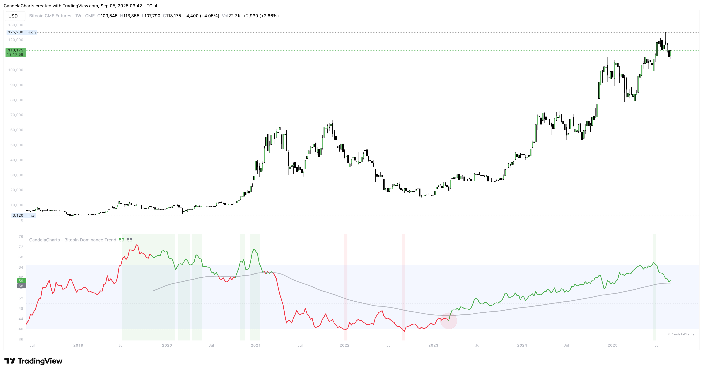

# Usage

<figure><figcaption></figcaption></figure>

This indicator is best used as a **market context tool** rather than a direct buy/sell signal.&#x20;

Here’s how traders typically apply it:

1. **Portfolio Allocation**
   * If BTC.D is trending **up**, Bitcoin is absorbing market liquidity → favor BTC exposure.
   * If BTC.D is trending **down**, altcoins gain strength → increase alt exposure.
2. **Altseason Timing**
   * Sustained drops below **40% dominance** often signal altcoin seasons.
   * Moves above **65% dominance** suggest Bitcoin dominance cycles, where alts underperform.
3. **Trend Confirmation**
   * Use the moving average cross as a momentum confirmation.
   * Example: BTC.D above MA + rising → altcoins are likely to underperform.
4. **Risk Management**
   * Rising BTC.D with falling TOTAL2 or TOTAL3 → increased downside risk for alts.
   * Falling BTC.D with rising TOTAL2 or TOTAL3 → healthy altcoin market rotation.
