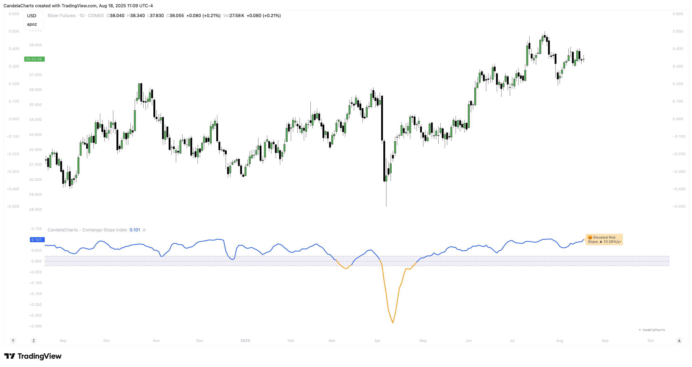
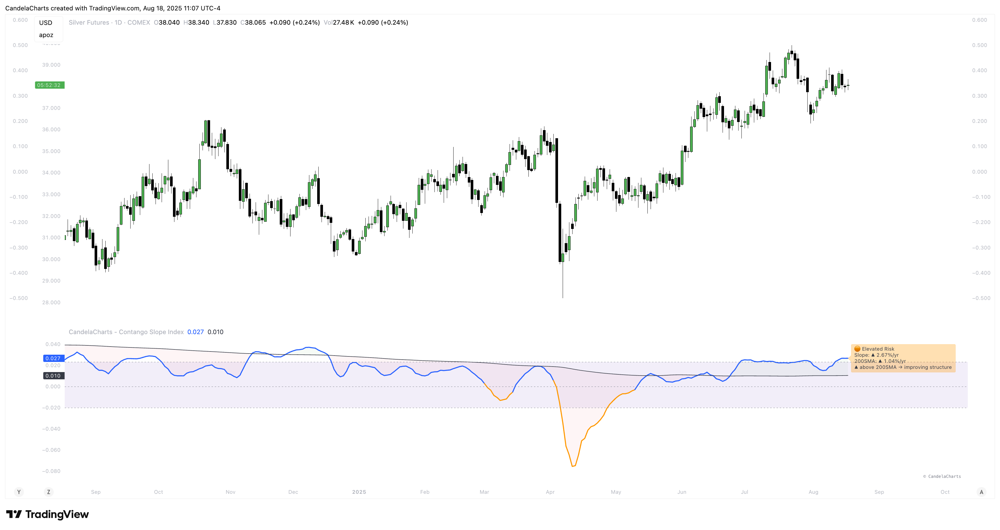
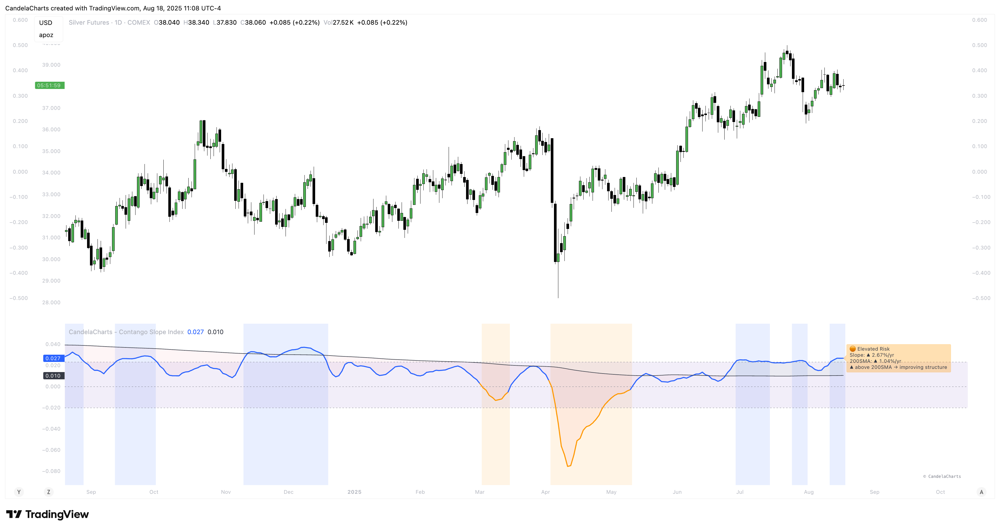

# Features

The Contango Slope Index offers a comprehensive set of features for analyzing volatility dynamics:

### **1. Multi-Tenor Volatility Input**

Users can select which VIX futures contracts to include in the slope calculation:

* `VIX1D` – Very short-term volatility (1-day forward)
* `VIX` – Spot VIX (1-month implied volatility)
* `VIX3M`, `VIX6M`, `VIX1Y` – Mid-to-longer-term volatility expectations

Each contract is normalized and forward-filled to ensure continuity in the term structure.

### **2. Dynamic Slope Calculation**

<figure><figcaption></figcaption></figure>

The indicator calculates the **slope of the VIX term structure** using linear regression on time-to-maturity (TTM) vs. volatility levels. This approach captures the overall shape of the curve more accurately than pairwise spreads.

When fewer than two tenors are active, the CSI defaults to measuring the trend of the single active series over a user-defined lookback window.

### **3. Moving Average Overlay**

<figure><figcaption></figcaption></figure>

A configurable moving average (SMA, EMA, RMA, WMA, VWMA) is applied to the smoothed slope to identify trend direction and momentum shifts:

* Default: 200-period MA
* Configurable length and type
* Visualized with customizable line width and color

### **4. Regime Classification**

Based on the slope value and its relationship to the moving average, the CSI classifies current market conditions into distinct regimes:

| Regime                             | Condition                   |
| ---------------------------------- | --------------------------- |
| **Backwardation (Bullish Signal)** | Slope < 0                   |
| **Recovery**                       | Slope < 0 but above MA      |
| **Capitulation**                   | Slope < 0 and below MA      |
| **Elevated Risk**                  | Slope > 0.0232 and above MA |
| **Cooling Phase**                  | Slope > 0.0232 but below MA |
| **Bullish Contango**               | Slope ≤ 0.0232 and above MA |
| **Normal**                         | Slope ≤ 0.0232 and below MA |

### **5. Visual Enhancements**

<figure><figcaption></figcaption></figure>

* **Color-coded slope line**: Blue when positive, orange when negative
* **Fill between slope and MA**: Green when slope > MA, red when slope < MA
* **Background shading**: Optional regime-based background coloring
* **Reference lines**:
  * `0.0232` (%/yr): Long-term average contango level (\~2.32%/year)
  * `0`: Flat curve (transition point between contango and backwardation)
  * `-0.02`: Mild backwardation threshold

### **6. Real-Time Label & Tooltip**

On the last bar, a dynamic label displays:

* Current regime
* Slope value and direction
* MA value and comparison
* Trend interpretation (e.g., "improving structure")

### **7. Alert Conditions**

Six pre-configured alerts are available for integration into trading systems:

* 🚨 **Backwardation Detected** – Slope turns negative
* 🔚 **Exit Backwardation** – Slope crosses above zero
* ⚠️ **Elevated Complacency** – Slope exceeds 2.32%/yr
* 📈 **Potential Bullish Setup** – Slope crosses below zero
* ✅ **Slope Crosses Above MA** – Momentum improves
* ⚠️ **Slope Crosses Below MA** – Momentum deteriorates
