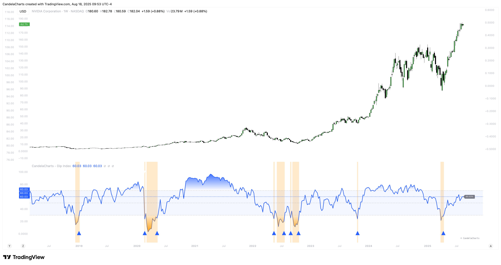

# Overview

<figure><figcaption></figcaption></figure>

The **Dip Index (DIPX)** is a market breadth oscillator that measures the percentage of assets within a selected index trading above a specified moving average, such as the 50, 100, 150, or 200-day average.


[features.md](features.md)



[usage.md](usage.md)



[confluences.md](confluences.md)



[faqs.md](faqs.md)


By evaluating the breadth of movement across constituents, the Dip Index provides a deeper understanding of underlying strength or weakness beyond the headline price.
