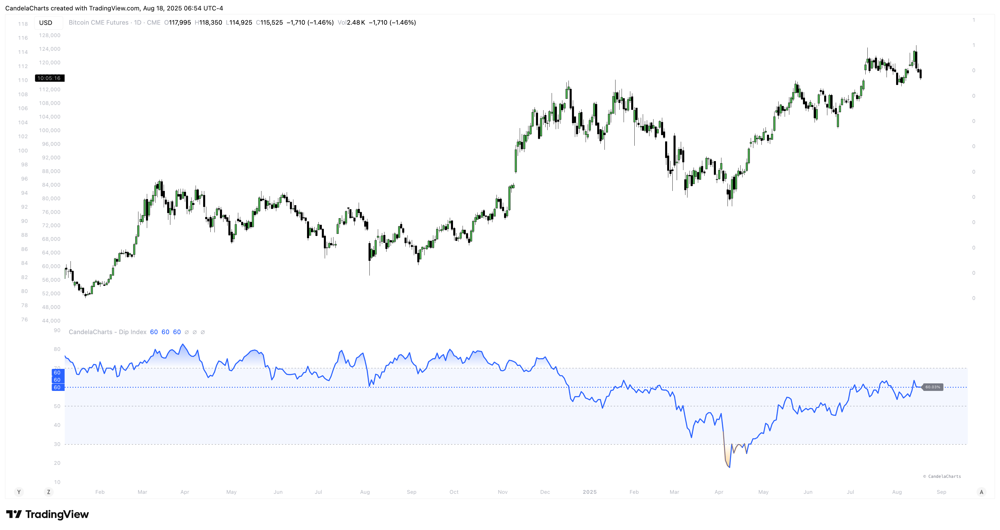
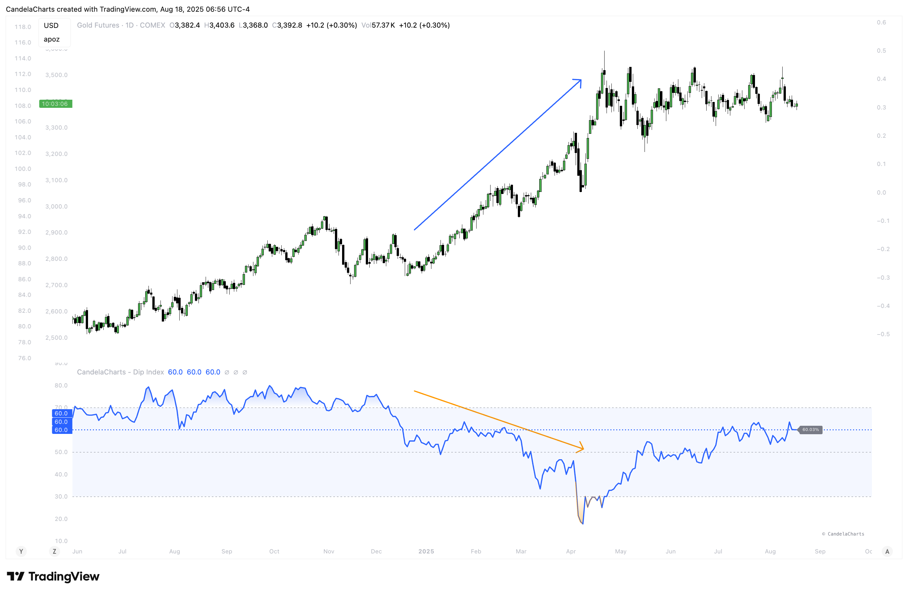
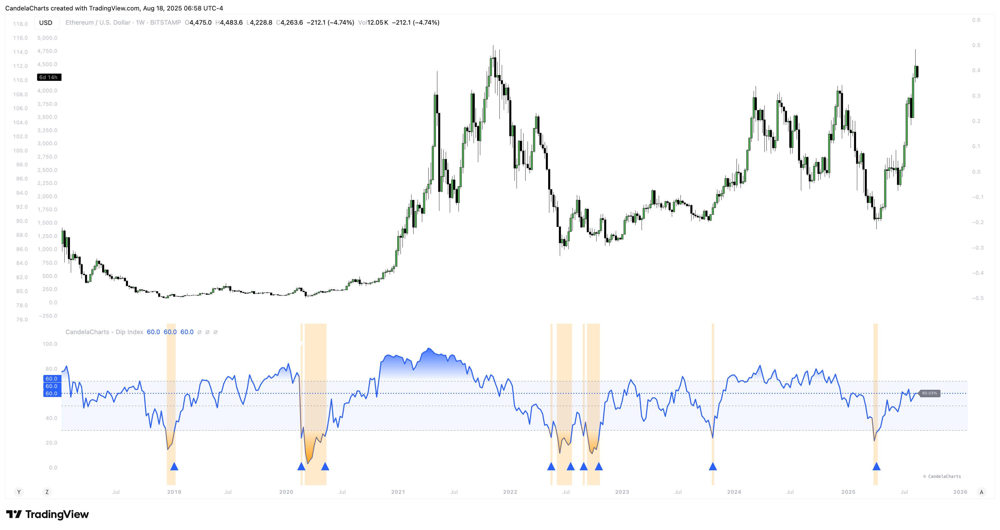

# Usage

How to use DIPX effectively in trading and analysis, including interpretation, signal usage, strategic applications, and best practices.

DIPX outputs values from **0% to 100%**, reflecting how widely participation extends across the underlying assets in an index or basket.

<table><thead><tr><th width="155.80078125"></th><th></th></tr></thead><tbody><tr><td><strong>0–20%</strong></td><td><strong>Extremely Weak</strong> – Very few components are above the MA; broad-based selling pressure. Potential reversal zone.</td></tr><tr><td><strong>20–40%</strong></td><td><strong>Weak</strong> – Majority of assets are underperforming; caution advised.</td></tr><tr><td><strong>40–60%</strong></td><td><strong>Neutral / Balanced</strong> – Participation is evenly split; market in equilibrium. Trend continuation likely.</td></tr><tr><td><strong>60–80%</strong></td><td><strong>Strong</strong> – Most components are above the MA; healthy momentum.</td></tr><tr><td><strong>80–100%</strong></td><td><strong>Extremely Strong</strong> – Nearly all components are outperforming; overextended conditions possible.</td></tr></tbody></table>

### **1. Assessing Market Health**

<figure><figcaption></figcaption></figure>

Use DIPX to evaluate whether price moves are supported by broad participation:

* In a **bull trend**, confirm strength by checking if DIPX stays above 50%.
* In a **bear trend**, watch for rebounds in DIPX to spot temporary relief rallies.

### **2. Detecting Divergences**

<figure><figcaption></figcaption></figure>

Divergence occurs when the **price trend** and **DIPX trend** disagree — often a precursor to reversal.

| Type                   | What to Look For                                 | Implication                                |
| ---------------------- | ------------------------------------------------ | ------------------------------------------ |
| **Bearish Divergence** | Price makes higher highs; DIPX makes lower highs | Momentum weakening → potential top         |
| **Bullish Divergence** | Price makes lower lows; DIPX makes higher lows   | Selling pressure fading → potential bottom |

**How to Spot It**:

* Overlay DIPX on the same chart as the index price.
* Use trendlines or horizontal markers to compare swing points.
* Focus on weekly or daily timeframes for reliability.


**Warning:** Divergences can persist — always wait for confirmation (e.g., price breakout or signal marker).


### **3. Signal-Based Entries/Exits**

<figure><figcaption></figcaption></figure>

When enabled (`Signals = true`), DIPX generates **triangle markers** when exiting extreme zones:

| Signal                   | Condition                                                  | Visual                |
| ------------------------ | ---------------------------------------------------------- | --------------------- |
| **Bullish Triangle (▲)** | DIPX crosses **above** `Oversold Value` (e.g., 20%, 30%)   | Green upward triangle |
| **Bearish Triangle (▼)** | DIPX crosses **below** `Overbought Value` (e.g., 80%, 70%) | Red downward triangle |

These signals represent **exits from overextended conditions**, not immediate reversals. They highlight moments when sentiment may be shifting.

### 4. Recommended Settings

| Setting              | Recommended Value                                            | Notes                                |
| -------------------- | ------------------------------------------------------------ | ------------------------------------ |
| Market               | Choose relevant benchmark (e.g., SP500, Nasdaq, Russel, etc) | Match to your trading domain         |
| **MA Length**        | `200`                                                        | Long-term trend filter               |
| **MA Type**          | `SMA`, `EMA`, `RMA`, `WMA`, `VWMA`                           | EMA reacts faster; SMA smoother      |
| **Oversold Value**   | `20`                                                         | Adjust based on volatility           |
| **Overbought Value** | `80`                                                         | Standard for most markets            |
| **Mode**             | `Line` , `Stepline`, `Stepline Diamond`, `Circle`, `Cross`   | Stepline emphasizes discrete changes |
| **Signals Show**     | `true`                                                       | Enable visual triggers               |
| **OB/OS Zones Show** | `true`                                                       | Improve readability                  |


Avoid setting OB/OS levels too tight (e.g., 30/70) — increases false signals. For volatile markets (e.g., crypto), consider widening to 15/85.


### 5. Timeframe Guidance

<table><thead><tr><th width="161.5078125">Timeframe</th><th width="231.234375">Suitability</th><th>Notes</th></tr></thead><tbody><tr><td><strong>1m – 4h</strong></td><td>❌ Not Recommended</td><td>DIPX uses daily-aggregated data; intraday noise dominates</td></tr><tr><td><strong>Daily (D)</strong></td><td>✅ Strongly Recommended</td><td>Matches data frequency; clearest signals</td></tr><tr><td><strong>Weekly (W)</strong></td><td>✅ Acceptable</td><td>Ideal for macro analysis and long-term positioning</td></tr><tr><td><strong>Monthly (M)</strong></td><td>⚠️ Limited Use</td><td>Too slow for active trading; useful for big-picture context</td></tr></tbody></table>

By integrating DIPX into your analysis, you gain a powerful lens into **market internals** — helping you distinguish between broad-based strength and narrow leadership, regardless of asset class.

Whether you trade stocks, futures, forex, or digital assets, DIPX enhances your ability to time entries, manage risk, and understand the true drivers behind price movements.
