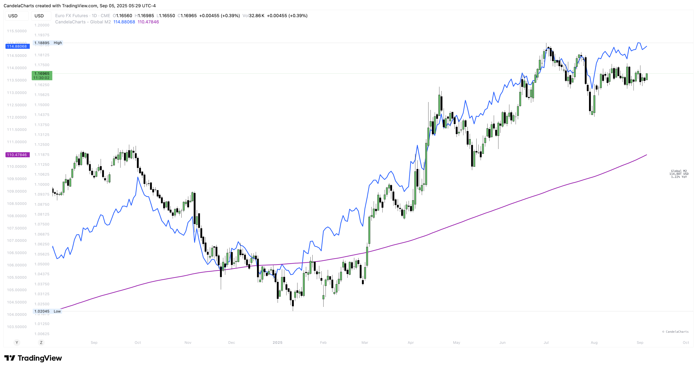

# Overview

<figure><figcaption></figcaption></figure>

At its core, Global M2 aggregates major economies’ money supply into a USD-normalized composite, adds a 52-week YoY lens for regime changes, and offers optional smoothing for clearer trend interpretation.

* Pulls national/area M2 series from TradingView ECONOMICS feeds.
* Converts non-USD bases into USD via corresponding FX pairs.
* Sums active regions into a single **Global M2** series shown in **trillions USD**.
* Computes **YoY (%)** with a 52-week lookback.
* Optionally applies **MA (SMA/EMA/WMA)**.
* Renders a compact on-chart label with current level and YoY.


[features.md](features.md)



[usage.md](usage.md)



[confluences.md](confluences.md)



[faqs.md](faqs.md)


**Covered regions (toggleable):** USA, Eurozone, China, Japan, UK, Canada, Australia _(M3)_, India, South Korea, Brazil, Russia, Switzerland, Mexico, Indonesia, Turkey, Saudi Arabia, Argentina, South Africa, Qatar.
