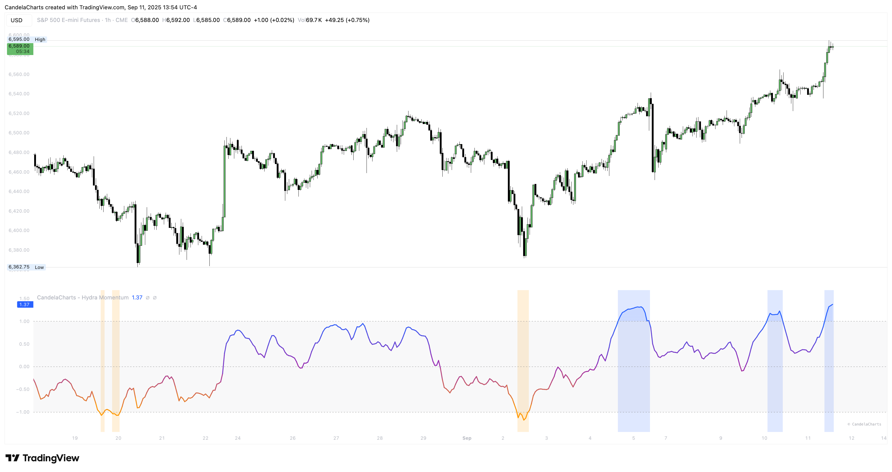

# Overview

<figure><figcaption></figcaption></figure>

This section orients you to what Hydra is and when it helps.

* **What it is:** a two-engine oscillator—Directional momentum plus a Quality filter—normalized around 0 with stretch context at ±1.
* **What it solves:** avoids taking signals in sloppy, low-quality tape; favors moves with confirmation and follow-through.
* **When to use:** trend-following, pullback entries, momentum ignition, and divergence fades—across intraday to swing timeframes.
* **How it adapts:** selectable components, optional smoothing/MA, and adjustable thresholds to match asset volatility.


[features.md](features.md)



[usage.md](usage.md)



[confluences.md](confluences.md)



[faqs.md](faqs.md)


Hydra helps you focus on higher-probability momentum and skip low-quality churn, with simple controls to fit your market and timeframe.
