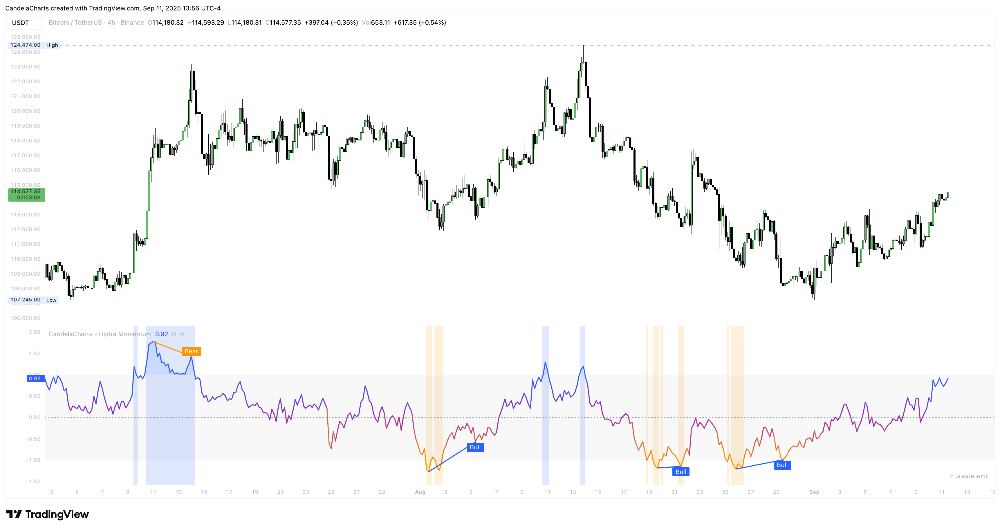

# Usage

<figure><figcaption></figcaption></figure>

This section shows you how to **read the pane** and turn it into a simple workflow.

### How to read

* **Directional Jumper (main line):** above **0** = bullish tilt; below **0** = bearish tilt; color shifts from orange (bear) → purple (neutral) → blue (bull).
* **±1 band:** pushes **> +1** or **< −1** get gradient fills and a subtle background—treat as stretch/pressure zones.
* **Directional MA (optional):** smoother trigger for cross-based entries.
* **Nondirectional Average (optional):** shows market quality; require **≥ filter** to avoid whipsaws.
* **Divergences (optional):** regular bullish/bearish labels; **Only show High-Prob** focuses on extended pivots.

### Workflow

1. **Set bias:** favor longs above **0**, shorts below **0**; use **±1** for stretch context.
2. **Gate quality:** enable Nondirectional and require it **≥ filter** (default **−0.25**; use **0/0.25** to be stricter).
3. **Pick trigger source:**
   * **Directional Source** for faster, more signals.
   * **Directional EMA** for calmer entries (often tighten thresholds toward **±1**).
4. **Act & manage:** take aligned crosses; after **±1** spikes, watch acceptance (trend) vs. rejection (mean-reversion).
5. **Use divergences selectively:** keep **High-Prob** on; prioritize signals at key S/R, VWAP, or trendlines.
