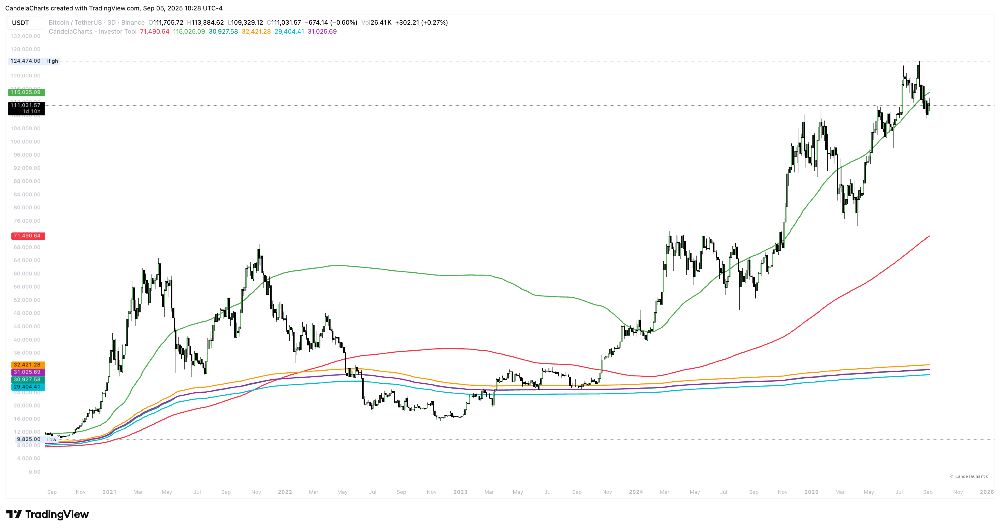

# Overview

<figure><figcaption></figcaption></figure>

Anchored valuation (WVAP), dispersion (bands), and baseline trend (MA) work together so you can time entries, trims, and adds with context instead of impulse.

* **Time-aware MA length:** `ma_length = it_ma_years × bars_per_year`, where bars/year adjusts by chart: Daily≈365, Weekly≈52, Monthly≈12, Intraday≈252.
* **Deviation bands:** `Upper/Lower = MA ± (multiplier × stdev)` using the same lookback as the MA.
* **Anchored WVAPs:** Four concurrent WVAPs (Open/High/Low/Close) that **reset automatically** at the start of the selected anchor (Day, Week, Month, Quarter, Year, Decade, Century).
* **Plots:**
  * Investor MA (red) — titled “Investor Bottom (2Y SMA)” in code.
  * Upper Band (green) — “Investor Top (Upper Band)”.
  * Lower Band (blue) — hidden by default (`display.none`).
  * WVAP (Open/High/Low/Close) — shown when enabled.


[features.md](features.md)



[usage.md](usage.md)



[confluences.md](confluences.md)



[faqs.md](faqs.md)


Together, these capabilities form a durable playbook—read the MA slope, respect the bands, and use anchor confluences—to turn noisy moves into deliberate portfolio decisions.
