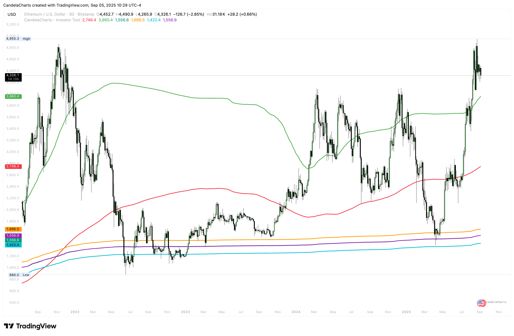

# Usage

<figure><figcaption></figcaption></figure>

Turn drift into a plan by reading baseline slope, respecting dispersion, and letting anchors guide your execution.

**Playbook**

* **Regime by slope:** Rising MA → bias to accumulate on pullbacks; falling MA → favor patience, hedges, or trims.
* **Trade the stretch:**
  * Near **Upper Band** → look for distribution, take partials, or require momentum confirmation to add.
  * Near **Lower Band** (if enabled) → watch stabilization for staggered adds.
* **Anchor confluence:** Intersections of **Year WVAP** with **Quarter/Month WVAPs** often mark high-probability reaction zones.
* **Intraday awareness:** On intraday charts, “years” map to ≈252 bars/year; interpret the MA as a long sample of trading sessions.
* **Portfolio cadence:** Use MA slope + band touch + WVAP retest as a three-point checklist for scaling decisions.

**Parameter guidance**

* **MA Period (Years):** 2–3 for business cycle sensitivity; 5–10 to smooth secular noise.
* **Multiplier:** 1.2–1.8 for equities/indices; 1.6–2.4+ for crypto; 1.0–1.4 for low-vol defensives.
* **Anchors:**
  * **Year:** Strategic fair-value magnet.
  * **Quarter/Month:** Tactical pullbacks within the yearly path.
  * **Week/Day:** Swing/active trading precision.
