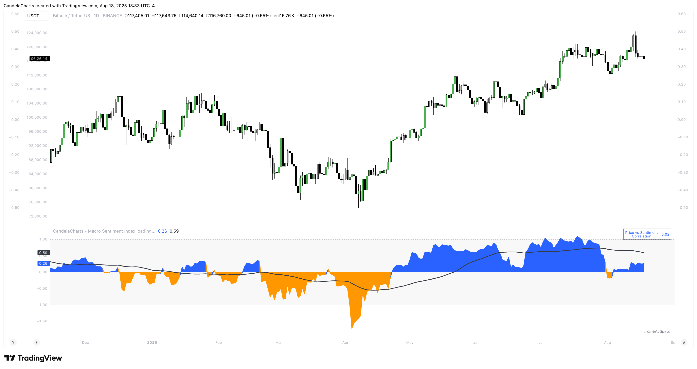
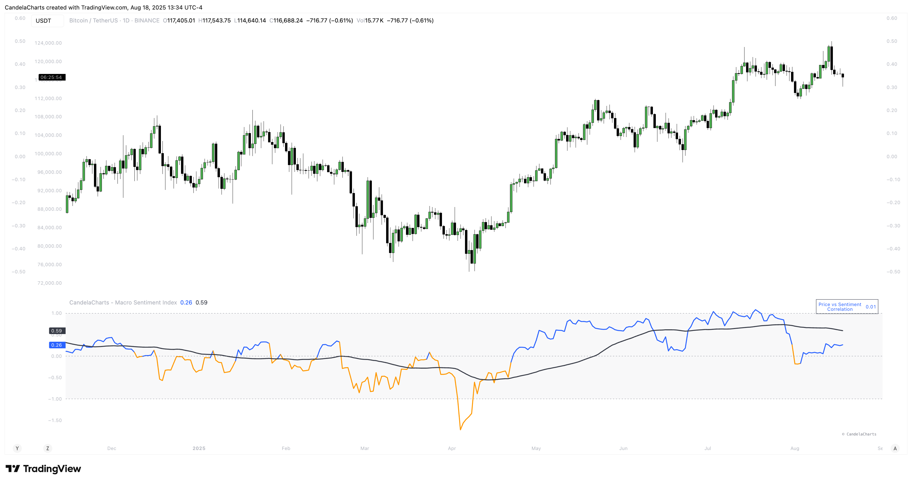

# Features

### **1. Multi-Dimensional Inputs**

MSI integrates diverse asset classes and indicators:

* **Equity Benchmarks**: SPY, QQQ, IWM, EEM
* **Fixed Income**: TLT, HYG, LQD, SHY
* **Commodities**: Gold (GC), Copper (HG), Oil (CL), BCOM
* **Volatility**: VIX, VVIX, MOVE, SKEW
* **FX Pairs**: USD/JPY, USD/CHF, AUD/JPY, DXY
* **Yield Curves**: 10Y-2Y Spread (TYX), 10Y-5Y (TNX-FEDFUNDS)
* **Monetary Policy**: SOFR, ED, FF futures
* **Global Macro**: BDIY, M2, TED Spread, Put/Call Ratio
* **Sector Rotation**: XLU/XLY, XLY/XLP
* **Sentiment Ratios**: SPY/TLT, HYG/LQD, BTC/Gold, Copper/Gold

### **2. Adaptive Scoring System**

Each input is transformed into a **z-score** over a configurable lookback window (default: 60 days), capturing relative strength/weakness in real-time. Directionality is adjusted so that all components contribute consistently to the final score:

* Rising equities, credit, commodities → **positive contribution**
* Rising volatility, safe-haven assets, yield curve inversion → **negative contribution**

### **3. Weighted Aggregation**

Users can customize the influence of each component via adjustable weights (default: 0.1–3.0). This allows tuning for specific regimes or beliefs about market structure.

The final index is a **weighted average** of all active component scores.

### **4. Smoothing & Visualization Modes**

<figure><figcaption></figcaption></figure>

* Optional **moving average** (SMA, EMA, RMA, VWMA) with user-defined length and type
* Multiple display styles: **Columns**, **Histogram**, **Area**, or **Line**
* Neutral threshold at 0, with upper (+1) and lower (−1) zones marking extremes

### **5. Correlation Monitoring**

A dynamic **price vs. sentiment correlation table** appears on-chart, calculating the rolling correlation (default: 20 periods) between asset price changes and the MSI. This helps identify divergence and regime shifts.

### **6. Customizable UI**

<figure><figcaption></figcaption></figure>

* Adjustable text size and font (Monospace or Default)
* Optional branding toggle
* Configurable color scheme for bull/bear phases and MA line
