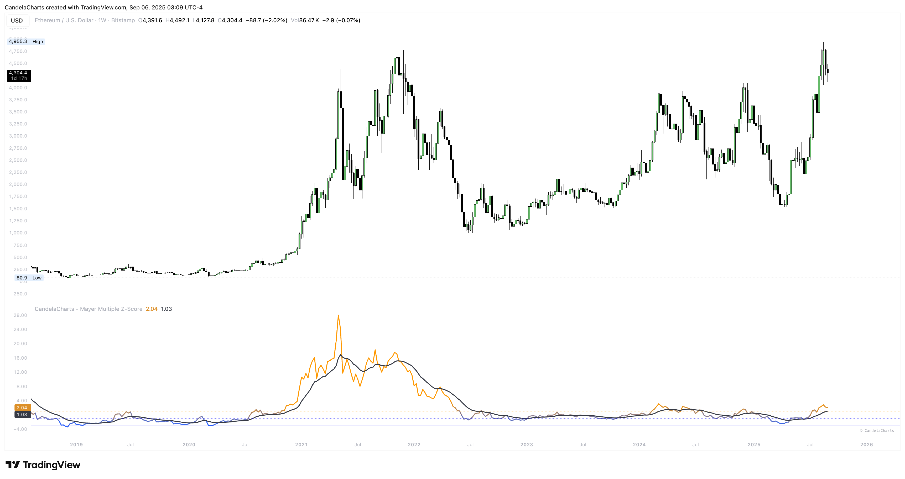

# Overview

<figure><figcaption></figcaption></figure>

The indicator computes a long-term SMA (cumulative until the lookback is filled, then rolling), divides price by that SMA to form the **Mayer Multiple**, and linearly maps your chosen “undervalue” and “overvalued” multiples (e.g., 0.5× and 2.0×) to **−3σ and +3σ**.&#x20;


[features.md](features.md)



[usage.md](usage.md)



[confluences.md](confluences.md)



[faqs.md](faqs.md)


The result is a standardized **Z-Score** with an optional EMA smoothing layer, optional extreme-zone fills, and an optional bar-color gradient for heat.
