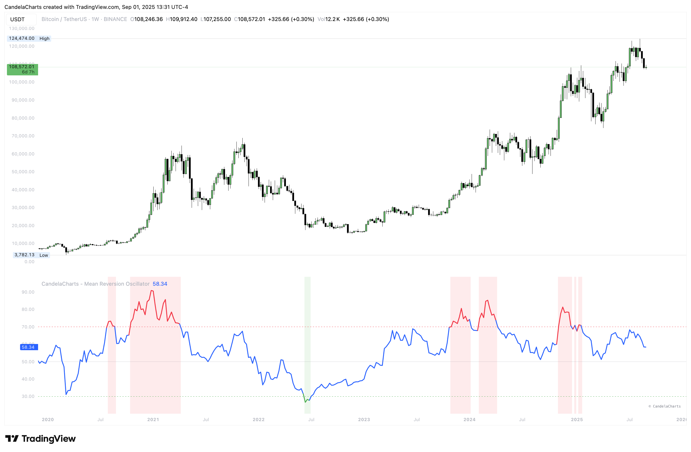

# Overview

<figure><figcaption></figcaption></figure>

The Mean Reversion Oscillator (MRO) is a bounded 0–100 indicator that shows how far price has deviated from its statistical mean.&#x20;


[features.md](features.md)



[usage.md](usage.md)



[confluences.md](confluences.md)



[faqs.md](faqs.md)


By normalizing deviations into a consistent scale, it helps traders spot overbought/oversold conditions, potential mean reversion setups, and momentum shifts around a moving average.
