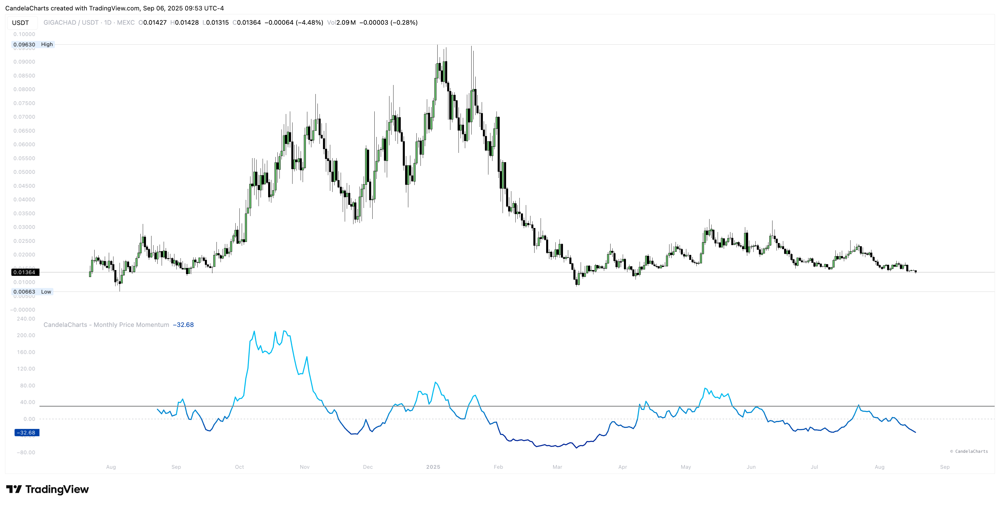

# Usage

<figure><figcaption></figcaption></figure>

Turn the oscillator into a checklist for entries, exits, and risk.

**Playbook**

* **Trend confirmation:** Above 0 supports longs; below 0 supports shorts/defense.
* **Overheated thrusts:** After tagging +30%, look for deceleration to manage risk or take profits.
* **Capitulation scans:** Very negative ROC% (e.g., ≤ −20%) can mark value zones—wait for stabilization.
* **Divergences:** Price HH vs. flat/LL momentum can precede pullbacks.
