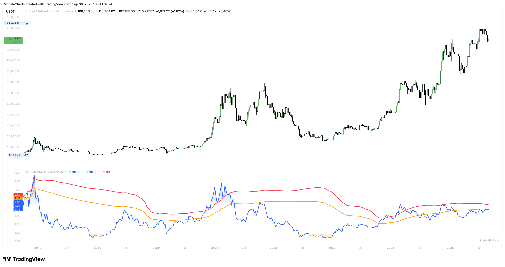

# Overview

<figure><figcaption></figcaption></figure>

This indicator displays the **MVRV Ratio** (Market Value / Realized Value) for **BTC** or **ETH** from curated data feeds, overlays classic cycle thresholds (3.5, 2.5, 1.0, 0.8), and optionally adds **statistical bands** (mean + 1σ/2σ) to ground readings in recent history.&#x20;


[features.md](features.md)



[usage.md](usage.md)



[confluences.md](confluences.md)



[faqs.md](faqs.md)


Background and range shading emphasize typical overvaluation and extreme stress areas.
