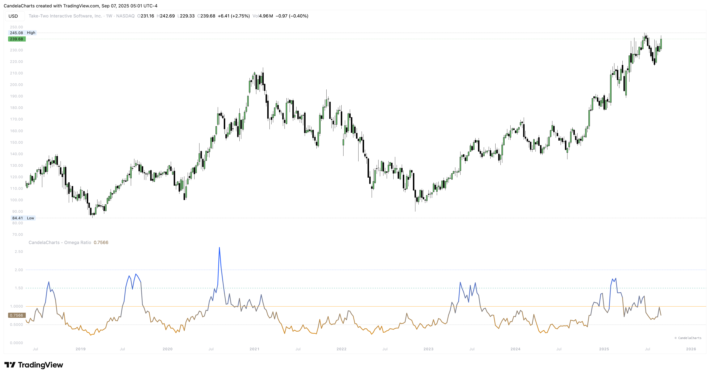

# Usage

<figure><figcaption></figcaption></figure>

Turn the ratio into rules you’ll actually follow—gate, size, and adapt.

**Playbook**

* **Gatekeeper:** Take risk only when **Omega > 1.0** (or **> 1.5** for stricter quality).
* **Sizing:** Scale up when Omega rises and stays elevated; scale down when it sinks toward 1.0.
* **Adaptation:**
  * Raise the **target** to demand more edge (ratio falls, but quality bar rises).
  * Lengthen the **Period** to smooth chop; shorten to catch turns sooner.
* **Mode selection:** Use **log** on volatile/crypto assets or multi-% bars; **linear** on low-vol equities/indices.

**Reading the scale**

* **< 1.0:** Shortfalls dominate → defensive posture, fewer setups, smaller size.
* **≈ 1.0:** Breakeven quality → wait for confirmation or a better entry model.
* **> 1.5 / > 2.0:** Good / strong quality → trends/carry more likely to pay.
