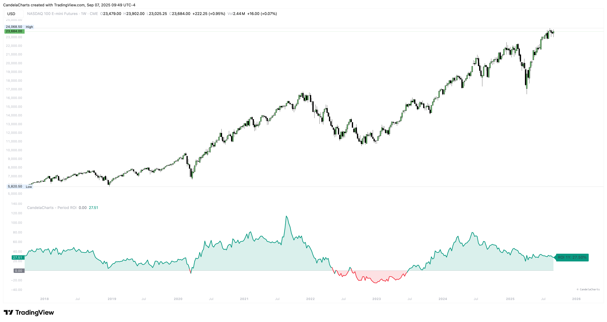

# Usage

<figure><figcaption></figcaption></figure>

Turn ROI into practical workflows for ranking, timing, and risk.\
**Quick start**

1. Choose a preset (e.g., 1Y for cycles, 3–6M for rotation, 1M for tactical).
2. Keep the same window across a watchlist to rank by the label values.
3. Use the zero line as a simple regime filter for entries/exits.

**Playbook**

* **Ranking & rotation:** Sort watchlists by 3–6M ROI to surface leadership early.
* **Trend confirmation:** Favor longs while the 1Y ROI stays > 0; be cautious when it slips < 0.
* **Pullback gauge:** Compare current 1M ROI during dips vs. previous dips to gauge severity.
* **Cross-asset lens:** Apply the same window across equities/crypto/FX to normalize performance.
