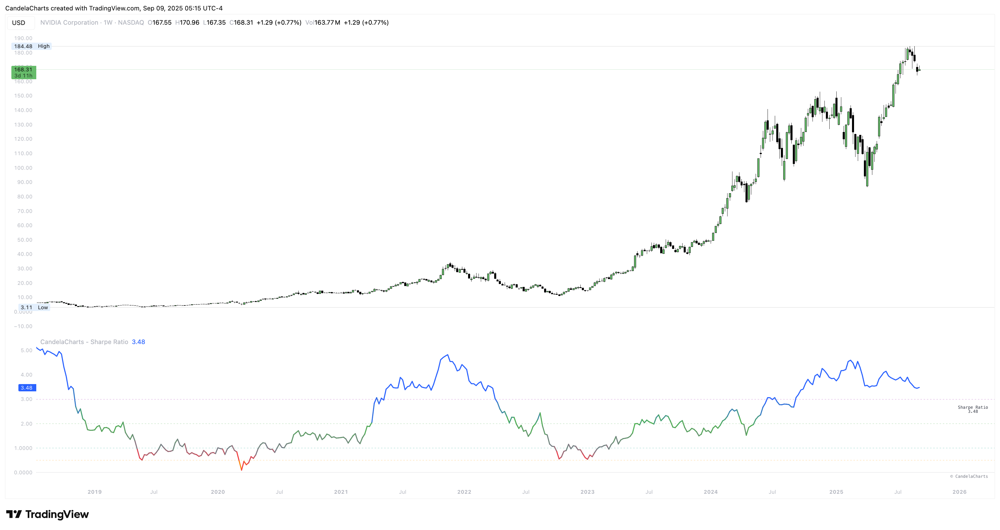

# Overview

<figure><figcaption></figcaption></figure>

This implementation computes per-period returns from your chosen source and timeframe, subtracts a per-period risk-free hurdle derived from your annual input, and summarizes reward vs. variability over a configurable lookback.&#x20;


[features.md](features.md)



[usage.md](usage.md)



[confluences.md](confluences.md)



[faqs.md](faqs.md)


You can smooth the line with a light EMA and read it against well-known guideposts (0, 0.5, 1, 2, 3) with a right-edge label for quick checks.
