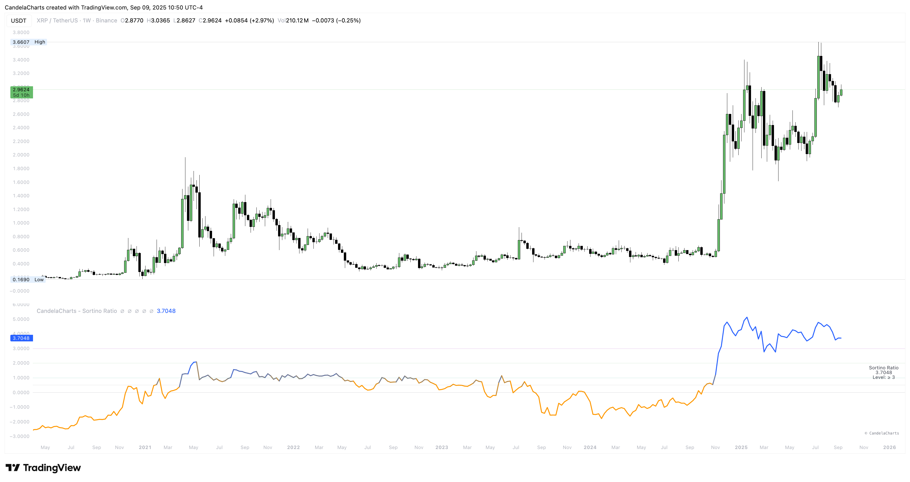

# Overview

<figure><figcaption></figcaption></figure>

This implementation aligns the target (MAR) with your return type, computes excess returns per bar, and divides their average by the _downside_ deviation over a lookback.&#x20;


[features.md](features.md)



[usage.md](usage.md)



[confluences.md](confluences.md)



[faqs.md](faqs.md)


You can annualize for comparability, switch between **Percentile Bands** (P50/P75/P90 etc.) and **Fixed Levels** (0/0.5/1/2/3), and use a right-edge label that summarizes percentile bucket or level.
