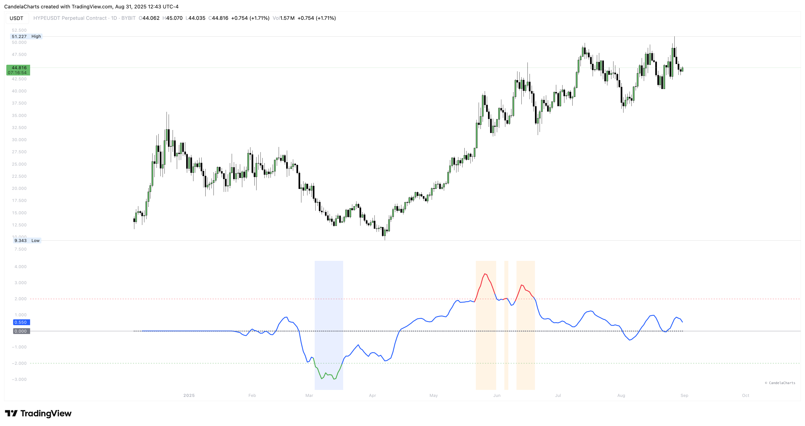

# Usage

<figure><figcaption></figcaption></figure>

The Vertex Oscillator is designed to simplify market interpretation by highlighting extremes of undervaluation and euphoria. Traders can use its key levels and divergence signals to anticipate potential reversals, manage risk, and refine entries or exits.

* **Identify Accumulation** → When the oscillator drops below **-2**, it signals potential undervaluation or accumulation phases. These conditions can precede rebounds, especially when supported by rising volume or price stability.
* **Spot Euphoria** → When the oscillator rises above **+2**, it highlights overheated or euphoric conditions. This often aligns with profit-taking zones or potential pullbacks.
* **Neutral Zone** → Readings around **0** indicate balanced conditions where neither buyers nor sellers dominate. This zone is useful for avoiding overtrading during indecisive market phases.
* **Divergences** → Watch for **bullish divergence** (price making lower lows while the oscillator makes higher lows) or **bearish divergence** (price making higher highs while the oscillator makes lower highs). Divergences often signal weakening momentum and potential reversals.
* **Best Practice** → The Vertex Oscillator is most effective when combined with **trend analysis, support/resistance levels, or volume tools** to filter out noise and confirm signals.
