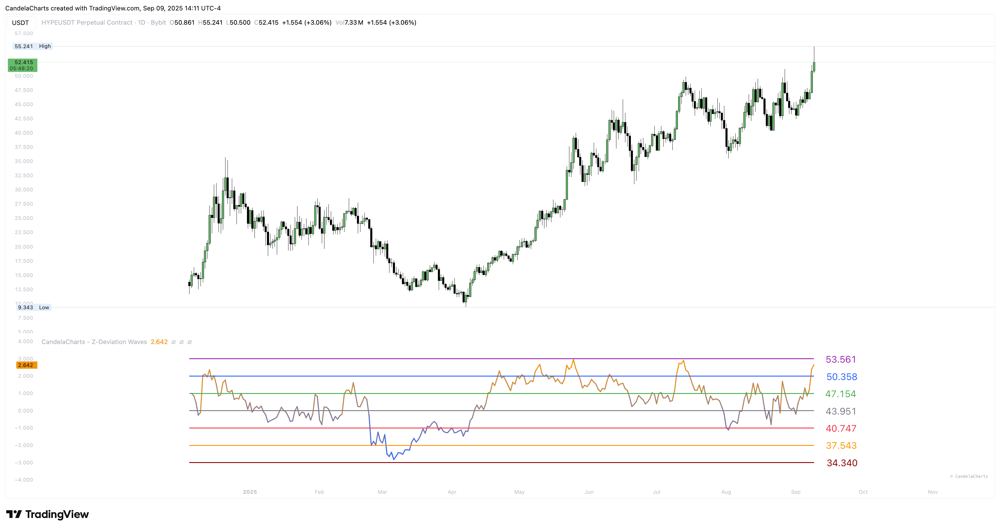

# Overview

<figure><figcaption></figcaption></figure>

Think of this indicator as a **statistical speedometer**. It computes a rolling mean and standard deviation over a window you choose (the **Period**), then expresses current price as a **Z-score**: negative values are below average, positive values above.&#x20;


[features.md](features.md)



[usage.md](usage.md)



[confluences.md](confluences.md)



[faqs.md](faqs.md)


The wave is color-graded—cooler near zero, hotter at extremes—so intensity is obvious at a glance.

You choose how to **label the guide lines**:

* **Z-score (σ):** show the classic −3σ…+3σ levels for pure, textbook context.
* **Price @ σ:** convert those σ levels into **live prices**—great for alerts and orders.
* **Price @ Z:** map Z onto a fixed numeric grid for clean, **presentation-ready** spacing across tickers.

Two small helpers round it out:

* **Trend columns:** a subtle backdrop that flips with the _direction of Z_ (are we stretching further, or easing back?).
* **Downside table (optional):** prints the current −1σ/−2σ/−3σ prices in the corner so you can set alerts quickly.
