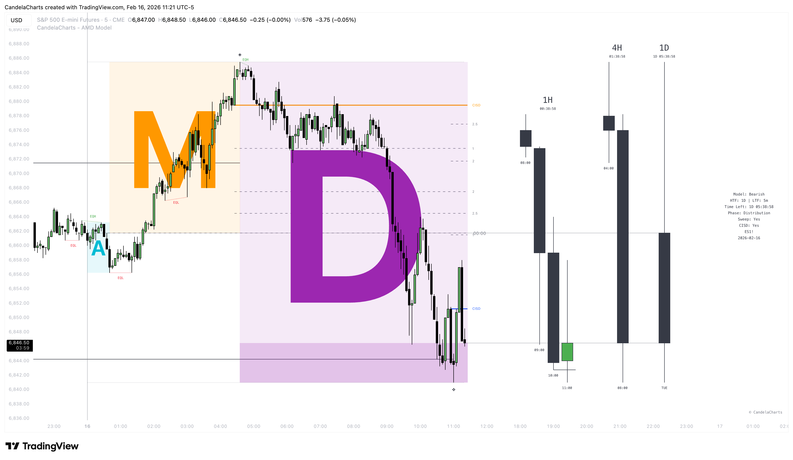

# AMD Model 🔜

The **AMD Model** by CandelaCharts is a powerful technical analysis tool designed to help you visualize the intricate dance of institutional price delivery. At its core, it breaks down market movements into three distinct phases: **Accumulation**, **Manipulation**, and **Distribution**.

<figure><figcaption></figcaption></figure>

If you've ever felt like the market tricked you—moving one way to stop you out before surging in the direction you originally predicted—you've likely experienced the "Manipulation" phase.&#x20;

This tool is built to turn that frustration into clarity. By mapping Higher Timeframe (HTF) price action directly onto your Lower Timeframe (LTF) charts, the AMD Model reveals the "why" behind the "what," giving you a lens to see market structure as it unfolds in real-time.

Whether you are a scalper looking for precision entries or a swing trader seeking confirmation, understanding the AMD cycle is key to aligning yourself with the smart money.


* This model is designed for educational and analytical purposes to study market structure, trends, and price behavior.
* It does not provide trading signals and should not be used as a substitute for independent analysis or proper risk management.
* The model is timeframe - and symbol-agnostic, automatically adapting to any market, asset, or chart it is applied to.

