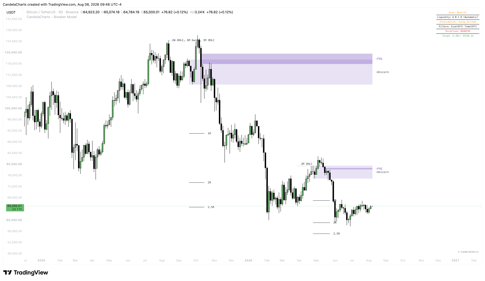

# Breaker Model™

The **CandelaCharts - Breaker Model** is a comprehensive, institutional-grade indicator designed to automate the detection of one of the most powerful price action setups: the Breaker Block.

<figure><figcaption></figcaption></figure>

By systematically identifying higher-timeframe liquidity sweeps followed by a structural shift and the formation of a Breaker, this tool removes the subjectivity from your trading. It not only highlights the entry zones but also manages the entire trade lifecycle—from plotting invalidation levels to projecting customizable Risk-to-Reward (R:R) targets.


* This model is designed for educational and analytical purposes to study market structure, trends, and price behavior.
* It does not provide trading signals and should not be used as a substitute for independent analysis or proper risk management.
* The model is timeframe - and symbol-agnostic, automatically adapting to any market, asset, or chart it is applied to.

