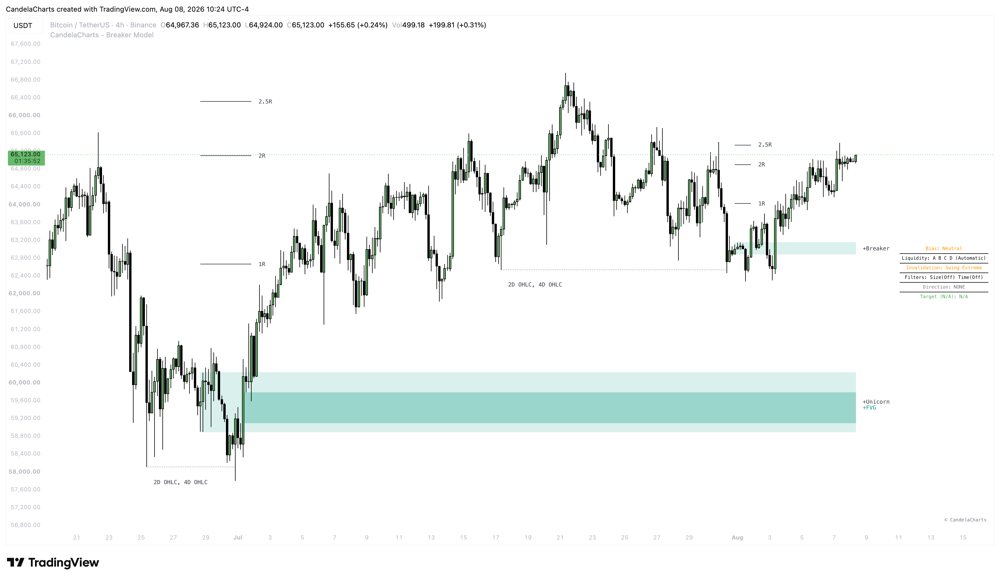

# Dashboard

<figure><figcaption></figcaption></figure>

The Breaker Model includes a dynamic, on-chart dashboard that acts as your trade assistant.

### Dashboard Overview

The dashboard can be positioned in any corner of your chart and scaled to your liking. It displays real-time data about the most recently confirmed setup, including its status (Active, Target Hit, Invalidated) and its directional bias.

### Position Sizing Calculator

If you enable **Show Position Size**, the dashboard becomes a powerful risk management tool.

* **Account Balance**: Input your total trading capital.
* **Risk Type**: Choose whether you risk a fixed percentage of your account (e.g., `1.0%`) or a fixed dollar amount per trade.
* **Risk Amount**: The value associated with your risk type.

When a setup forms, the indicator automatically calculates the pip/point distance from the entry to the invalidation level, applies your risk parameters, and displays exactly how many units/contracts you should trade directly on the dashboard.
