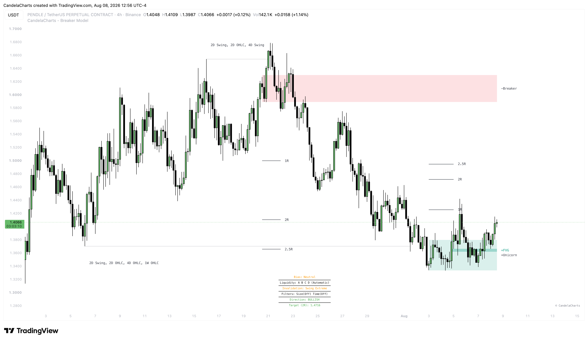

# Framework

This page walks you through the step-by-step process of trading with the Breaker Model — from sourcing liquidity to managing a live position. Think of it as your playbook.

<figure><figcaption></figcaption></figure>

### Step 1 — Identify HTF Liquidity

The first thing you want to do is look at the liquidity levels the model has drawn on your chart. The Breaker Model tracks up to 4 HTF sources (Source A through D), each pulling in key levels from a different timeframe. These levels represent untouched highs and lows where stop-losses are resting — the fuel that institutions need to engineer reversals.

Spend a moment reading the levels. Which ones are closest to the current price? Which side of the market has more exposed liquidity — buy-side (above) or sell-side (below)? If you see a cluster of unswept highs just above the current price on a bearish day, that's a target the market is likely heading toward.

Understanding where liquidity sits is the foundation. Without this context, every setup is just a coin flip.

### Step 2 — Wait for the Liquidity Sweep

Now you wait. This is the hardest part for most traders, but it's where the edge comes from.

A sweep happens when price pushes through one of those HTF levels — even by a single tick — to grab the stop-loss orders sitting on the other side. The indicator automatically marks the sweep with a horizontal line, so there's no guesswork.

Don't react to the sweep itself. The sweep is just step one. Price can (and often does) continue through a level for several candles before reversing. The sweep tells you that liquidity has been taken; it doesn't tell you the reversal has started.

### Step 3 — Wait for the Breaker Block

This is where the model does the heavy lifting.

After the sweep, the indicator monitors the reaction and looks for the origin candle — the candle that caused the move into the liquidity pool. When price aggressively reverses and closes back through that candle, the origin flips from being an order block to a **Breaker Block**.

In practical terms:

* A **Bullish Breaker** forms when price sweeps a low, then rips back up and closes above the down-close candle that created the low. That candle is now support.
* A **Bearish Breaker** forms when price sweeps a high, then drops back down and closes below the up-close candle that created the high. That candle is now resistance.

The indicator draws a box around this Breaker Block in your active color. That's your setup.

If you have **Unicorn Mode** turned on, the model goes one step further — it checks whether a Fair Value Gap (FVG) was created during the same displacement move that formed the Breaker. If the FVG overlaps with the Breaker Block, the setup is validated as a Unicorn. If there's no overlap, the setup is skipped entirely. This is the strictest filter available and produces the highest-probability entries.

### Step 4 — Plan Your Entry

The Breaker Box is your entry zone. Wait for price to retrace back into it before entering.

For a standard Breaker setup, you're looking to enter when price taps the Breaker Box — ideally near the midpoint or the edge closest to the displacement. Don't chase price after the initial break; let it come back to you.

For a **Unicorn** setup, the entry zone is even more precise — it's the overlapping area between the Breaker Block and the FVG. This tighter zone means better entries, tighter stops, and higher R:R.

A practical approach many traders use: set a limit order at the midpoint of the Breaker Box (or the Unicorn zone) and walk away. Either price comes to you, or it doesn't — and if it doesn't, you've lost nothing.

### Step 5 — Define Your Risk

Where you place your stop-loss depends on your **Invalidation** setting:

* **Use Swing as Invalidation**: Your stop goes beyond the absolute extreme of the liquidity sweep — the wick tip. This is the safest option because if price gets back to that level, the entire thesis is truly dead. The downside is a wider stop, which means smaller position sizing for the same dollar risk.
* **Use Breaker Edge**: Your stop goes beyond the opposite edge of the Breaker Block itself. This is tighter and gives you a significantly better Risk-to-Reward ratio. The trade-off is less room for noise — a deep retest of the Breaker might stop you out before reversing in your favor.

Choose based on the context. On volatile instruments or during high-impact news, the swing-based stop is usually worth the extra width. On clean, technical setups in quiet markets, the Breaker edge stop often works perfectly.

### Step 6 — Manage to Target

Once you're in, the R:R Projection lines are already on your chart. These are your take-profit levels based on the targets you've configured (e.g., `1, 2, 2.5`).

You have two management styles depending on your **Mode** setting:

* **Fixed Mode**: Targets are anchored from the original entry zone and never move. This is the set-and-forget approach. You know exactly where your 1R, 2R, and 2.5R targets are from the moment you enter, and you manage accordingly — take partials at 1R, move stop to breakeven, let the rest run to 2R or beyond.
* **Trailing Mode**: Targets dynamically adjust as price moves in your favor. This is ideal for active trade management — as your position grows, your targets grow with it. It's particularly useful in trending markets where you want to capture extended moves rather than exiting at a fixed level.

The model tracks your targets for you. When price hits a target, the setup visually transitions to its inactive color and you'll receive an alert (if enabled). If price reverses and breaches the invalidation point instead, the setup is marked as invalidated — cut the trade and move on to the next opportunity.
