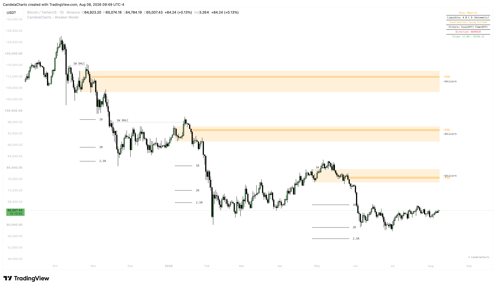

# Projections

<figure><figcaption></figcaption></figure>

The Breaker Model automatically handles trade management visuals by plotting dynamic Risk-to-Reward (R:R) projections as soon as a setup is confirmed.

### R:R Target Projection

Rather than relying on standard deviation or subjective fibonacci levels, the Breaker Model allows you to define strict R:R multiples.

* The indicator calculates the distance between your entry zone (the Breaker Block edge) and your invalidation point (the sweep extreme or opposite breaker edge).
* This distance is treated as `1R` (one unit of risk).
* The model then projects your predefined targets as horizontal lines on the chart.

### Projection Types (Modes)

You can choose how the indicator plots the projection targets using the **Mode** dropdown:

#### 1. Fixed Mode

In this standard mode, targets are calculated strictly from the initial entry zone and do not move. If you set a target of `2`, the line will always remain exactly 2R away from your original entry point, regardless of how price action develops thereafter.

#### 2. Trailing Mode

In this dynamic mode, targets adjust continuously. As price moves in your favor, the projection base trails along with price. This is incredibly useful for traders who employ active trailing stops or want to measure Risk-to-Reward relative to current price rather than the original entry zone.

### Customizing Targets

In the **Projections** settings group:

* **Show R:R Target?**: Toggle the visibility of these projection lines.
* **Targets**: Enter a comma-separated list of the R:R multiples you wish to track. For example, entering `1, 2, 2.5` will plot three separate take-profit lines at exactly 1R, 2R, and 2.5R respectively.
* **Style Settings**: You can fully customize the look of these lines (solid, dashed, dotted) and their colors under the `Style Settings` -> `Projection Line` inputs.

These targets are not just visual aids; the indicator tracks price action against them and can fire an alert whenever a specific target line is hit.
