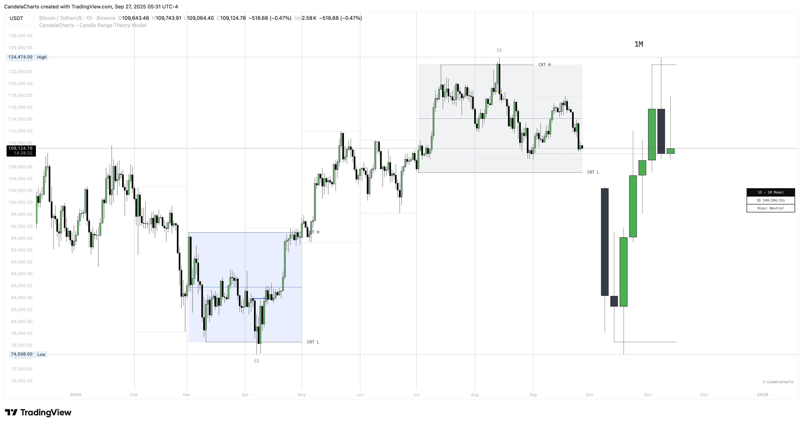

# Candle Range Theory Model™

**Candle Range Theory (CRT)** is a framework that treats **every candle as a tradable range**.&#x20;

<figure><figcaption></figcaption></figure>

A candle defines high/low, the next candle often **sweeps** one side (manipulation), **reclaims** back inside, and **distributes** toward the **opposite side** with **50% of the range** as a common first target.

**CRT in one line:** _Define a range → wait for a sweep → trade the reclaim back through the range._


This model does not provide Buy/Sell signals.

