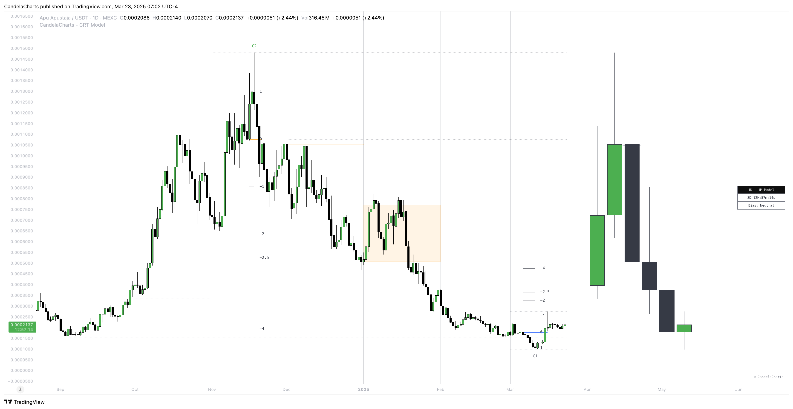

# Components

This CRT Model is designed to analyze and interpret price action patterns through various components, each of which plays a critical role in identifying market trends and providing actionable insights.

<figure><figcaption></figcaption></figure>

Below are the key components that make up the algorithm:

* **Sweep**
* **D-purge**
* **CISD**
* **Mean**
* **Projections**

## **Components**

### **1. Sweep**

**Definition:** A Sweep is a candlestick pattern where the price momentarily exceeds the high or low of the previous candle (via the wick) and then closes within that candle’s range.

**Formation:**

* **Bullish Sweep:** The price briefly surpasses the high of the prior candle and closes back within its range.
* **Bearish Sweep:** The price briefly surpasses the low of the prior candle and closes back within its range.

**Invalidation:**

* **Bullish Sweep:**
  * Invalidated if the next candle is bullish and its body closes above the high of the prior candle.
  * Invalidated if any subsequent bullish candle closes above the high of the prior candle.
* **Bearish Sweep:**
  * Invalidated if the next candle is bearish and its body closes below the low of the prior candle.
  * Invalidated if any subsequent bearish candle closes below the low of the prior candle.


Real-time models remove the sweep when the model is invalidated and the candle is closed. For other models, the sweep is retained and only invalidated if the sweep itself is invalidated, with the update clearly highlighted in the UI.


### **2. D-Purge**

**Definition:** A D-purge is a type of Sweep where the price exceeds both the high and low of the previous candle (via wicks) and then closes within the range of the prior candle.

**Formation:** A D-purge Sweep requires two higher-time-frame candles, with both sides of the previous candle being swept. The side that is swept last determines the direction of the D-purge.

**Invalidation:**

* **Bullish D-purge:**
  * Invalidated if the next candle is bullish and closes its body above the high of the prior candle.
  * Invalidated if any subsequent bullish candle closes above the high of the previous candle.
* **Bearish D-purge:**
  * Invalidated if the next candle is bearish and closes its body below the low of the prior candle.
  * Invalidated if any subsequent bearish candle closes below the low of the prior candle.

### **3. CISD**

**Definition:** Change in State of Delivery (CISD) refers to a shift in price delivery, indicating a transition between the buy-side and sell-side or vice versa.

**Formation:**

* **Bullish CISD:** Occurs when the price closes above the opening price of a bearish delivery.
* **Bearish CISD:** Occurs when the price closes below the opening price of a bullish delivery.

**Invalidation:**

* N/A (No specific invalidation).

### **4. Mean**

**Definition:** The mean is the midpoint of the previous candle.

**Formation:** The midpoint of the previous candle is marked at the close of the current candle.

**Invalidation:**

* **Bullish:** Invalidated if a bullish candle closes above the midpoint of the previous candle.
* **Bearish:** Invalidated if a bearish candle closes above the midpoint of the previous candle.

### **5. Projections**

**Definition:** Projections measures the variation or dispersion of price from a mean, often used to project price swings.

**Formation:** It’s calculated from the CISD level to the price point of a swing manipulation.

**Invalidation:** Once the price reaches the 2 standard deviation level.

