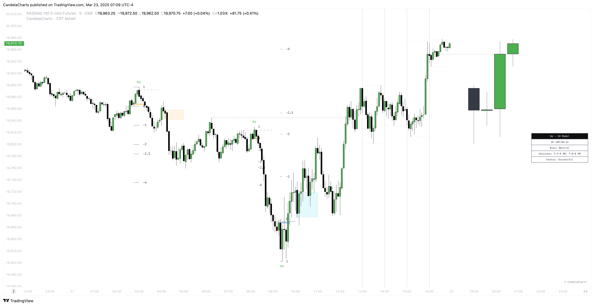

# Dashboard

The **Candle Range Theory (CRT) Model** Dashboard provides traders with essential, real-time information to support decision-making and improve market analysis.

<figure><figcaption></figcaption></figure>

Designed to present key data points, the dashboard offers a comprehensive view of current market conditions and the chart's state.

The following key metrics are displayed:

### Bias

This section indicates the overall market bias based on the current model and timeframe. It helps traders quickly assess whether the market is trending bullish, bearish, or neutral, providing a clear directional view. Understanding the market bias allows traders to align their strategy with prevailing market conditions.

### Current Model

The dashboard highlights the current model identified by the CRT Model, such as a Sweep or CISD (Change in Structure/Direction). This enables traders to instantly know which market structure is active, helping them understand the underlying market dynamics and identify potential opportunities.

### Remaining Time Until HTF Candle Close

The dashboard displays a countdown showing the remaining time until the higher timeframe (HTF) candle closes. This feature provides traders with valuable insight into how much time is left for the current candle to complete, aiding in the timing of entries, exits, or model validations.

It’s particularly useful for traders focusing on higher timeframes who need to make decisions based on the closure of key candles.

### **Sessions Filter**

This filter allows users to view trading data within specific market sessions (Killzones).

### **Status Filter**

This filter enables users to focus on specific states or conditions of the trading model.

### Conclusion

The CRT Model Dashboard consolidates critical information, including market bias, the current model, and the remaining time until the HTF candle closes.

By presenting these data points in a streamlined format, traders can make more informed decisions, enhancing their ability to navigate market conditions with greater confidence and precision.
