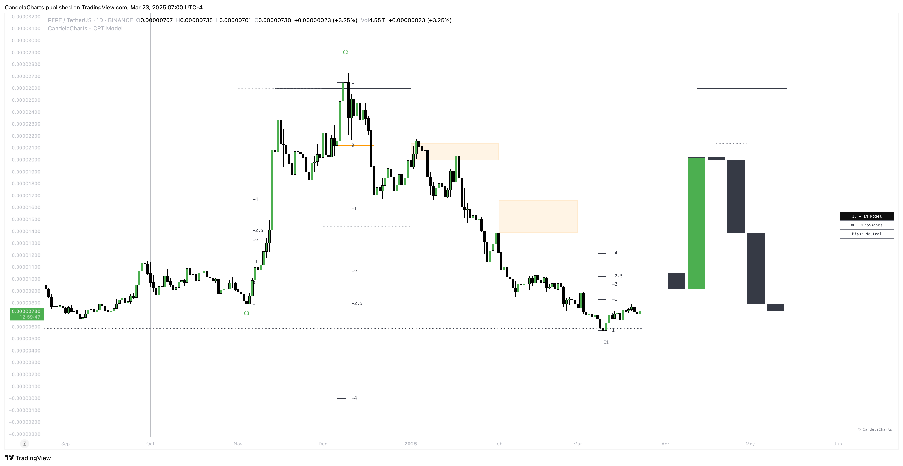

# CRT Model™

The **Candle Range Theory (CRT)** is a trading concept that focuses on analyzing the price movement within the range of individual candlesticks to understand market dynamics and predict future price actions.

<figure><figcaption></figcaption></figure>

It posits that each candlestick represents a distinct range of price action, defined by its high, low, open, and close, and that price movements are structured within these ranges.


This model does not provide Buy/Sell signals.

