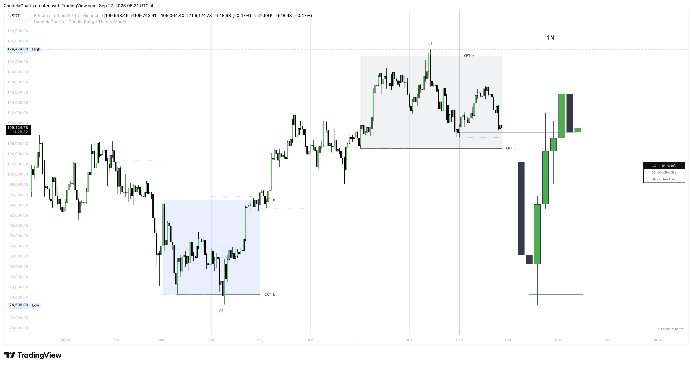

# CRT Model™

**Candle Range Theory (CRT)** is a framework that treats **every candle as a tradable range**.

<figure><figcaption></figcaption></figure>

A candle defines high/low, the next candle often **sweeps** one side (manipulation), **reclaims** back inside, and **distributes** toward the **opposite side** with **50% of the range** as a common first target.

**CRT in one line:** _Define a range → wait for a sweep → trade the reclaim back through the range._


* This model is designed for educational and analytical purposes to study market structure, trends, and price behavior.
* It does not provide trading signals and should not be used as a substitute for independent analysis or proper risk management.
* The model is timeframe - and symbol-agnostic, automatically adapting to any market, asset, or chart it is applied to.

