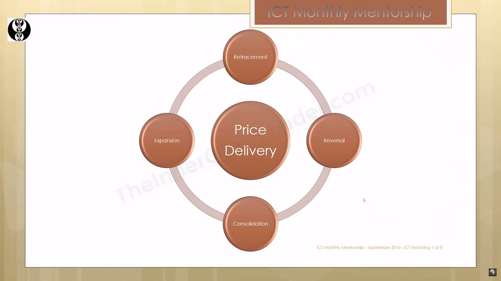
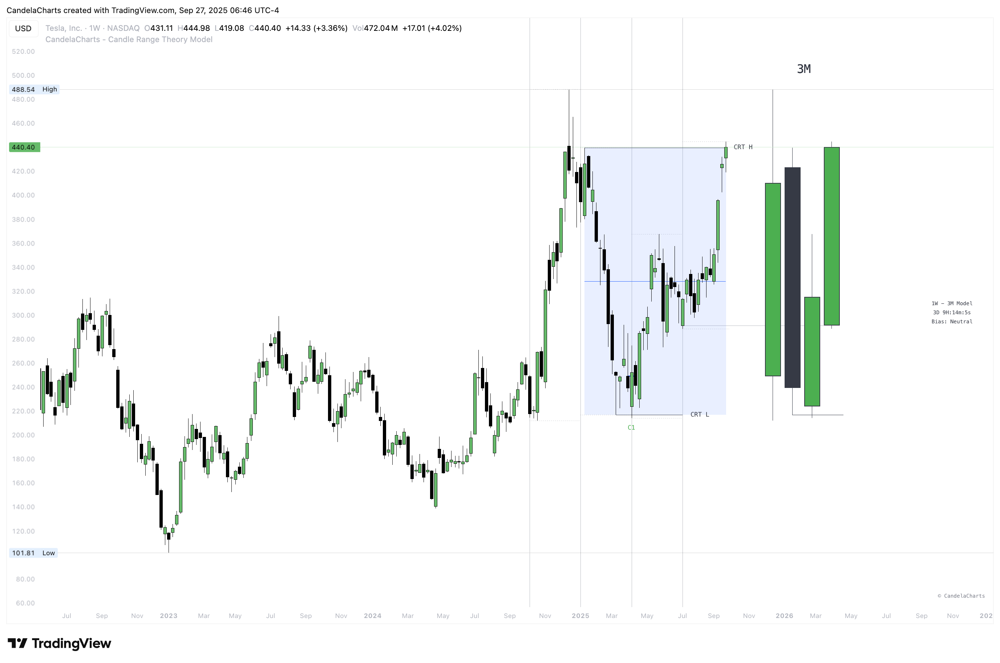
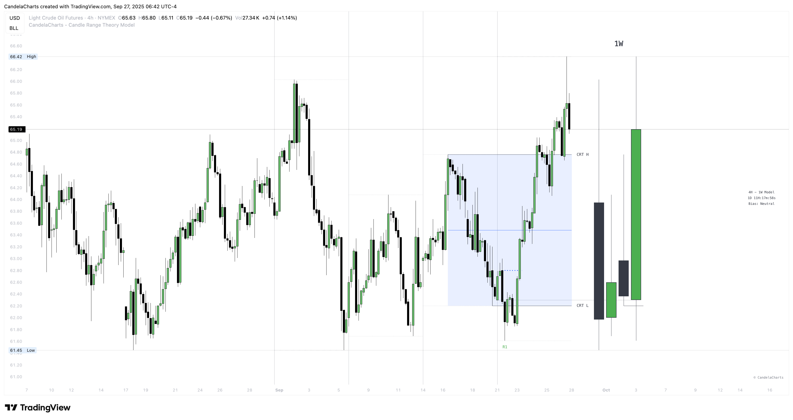
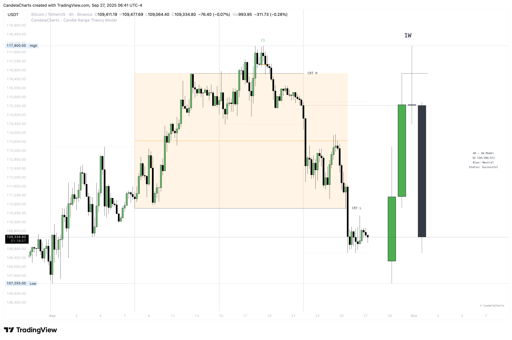

# Framework

A quick reminder helps you stay disciplined.

* **Don’t shotgun it:** Trying to trade every instance will fail over time.
* **Work from a higher-timeframe bias:** Build bias by either:
  * **Framing inside a higher-timeframe CRT Model:** Map the larger structure and execute within it.
  * **Using supporting concepts:** Price phases, equilibrium (0.5), and decisive candle closes to set and confirm direction.

**Bottom line:** The pattern is mechanical—**your edge is context**.

### Top-Down Analysis

This workflow keeps bias, plan, and entries speaking the same language.

#### Higher timeframe sets direction (1D / 1W / 1M)

Start with the daily, weekly, or monthly—whatever fits your style—to define bias. Do this by mapping a higher-timeframe CRT Model you’ll trade inside, or by using price phases, equilibrium, and strong closes to lock in direction.

#### Intermediate timeframe builds the plan (4H / 1H)

Drop to 4H/1H to validate bias and sketch structure. Look for a **Change in the State of Delivery (CISD)**, mark **points of interest (POIs)** that align with bias, and wait for proof at the level—a reaction, decisive close, or a **protected swing**.

#### Lower timeframe executes with precision (15M / 5M)

Use 15M/5M to refine entries and improve R:R. After the intermediate reaction/close, require a confirming **CISD** so all timeframes agree. Trigger on new protected highs/lows or continuation **order blocks (OBs)**, place stops beyond the protected high/low, and target higher-timeframe objectives.

### Expansion Candles

Set expectations so you don’t fight the tape.

* **Shallow pullbacks, fast legs:** Expansions retrace lightly and move with intent.
* **Half-range tendency:** Bullish expansions operate in the upper half; bearish in the lower half.
* **Context first:** Trade with the HTF bias, not every isolated print.

### Phases of Price

<figure><figcaption></figcaption></figure>

Label where you are so your actions stay consistent.

* **Reversal:** Initial turn that shifts delivery.
* **Expansion:** Impulsive leg in the new direction.
* **Retracement:** Pause/pullback—often shallow in expansions.
* **Consolidation:** Range digestion before the next leg.

### Mean / Equilibrium (0.5)

Use the midpoint to keep bias simple and objective.

<figure><figcaption></figcaption></figure>

#### Understanding the Mean

During expansions, pullbacks are usually shallow—treat **0.5** as the midline:

* Hold **upper half** → bias **higher**.
* Hold **lower half** → bias **lower**.
* If the respected half **fails**, flip bias and look for the opposite side of the range.

#### Applying the Mean in Expansions

In bullish expansions, the **upper half** often acts as support; in bearish expansions, the **lower half** often acts as resistance. If that behavior breaks, reassess your bias.

### Candle Wicks

Wicks often carry the signal; bodies tell the story after the fact.

#### What they indicate

* **Lower wick:** Drive down bought back up → bullish hint.
* **Upper wick:** Drive up sold back down → bearish hint.
* Strong reversal wicks often print a clear **“V”** on lower timeframes.

#### The 50% rule of a wick

Mark the wick midpoint (body→high for upper wick, body→low for lower wick):

* **Respect:** Holding the wick’s 0.5 favors continuation **against** the wick’s direction (lower-wick → up; upper-wick → down).
* **Disrespect:** Closing **through** the wick’s 0.5 often **invalidates** it and continues the original impulse.

Prioritize wicks that tag an **FVG** or sweep a key high/low; de-prioritize wicks formed entirely inside noisy internal ranges.

### Trading Candle 2 (The Reversal)

Use Candle 2’s wick, body, and context to judge whether the next leg trends or mean-reverts.

<figure><figcaption></figcaption></figure>

#### Expansion vs. reversal

* **Expansion candle:** Small wicks, strong body, one-way momentum.
* **Reversal (Candle 2):** Drives opposite, prints a long opposing wick, closes near open—context decides if it’s tradable.

**Key idea:** Small wicks favor continued expansion; large wicks often cap expansion because the range was “spent” building the wick.

#### Why wick size matters

* **Small-wick reversal:** More “runway”—target prior highs/lows, liquidity pools, standard-deviation projections.
* **Large-wick reversal:** Range consumed—expect mean-reversion toward the open or session extremes.

Think of wick size as a **fuel gauge**: less wick → more potential.

#### Correlated markets & SMT

Use related instruments for confirmation. If one market sits at a clean reversal but a correlated market is clearly stronger/weaker, prioritize the one that aligns with your bias to avoid false **CISD** and improve signal quality.

**Candle 2 takeaways**

* Small wick → more expansion potential.
* Large wick → tighter targets; continuations often follow **the next day** after a large-wick reversal.
* Always size expectations by wick size and session context.

### Trading Candle 3 (The Continuation)

Candle 2 flips bias; Candle 3 aims to capture the follow-through (Candle 4 often offers secondary continuation).

<figure><figcaption></figcaption></figure>

#### The key concept: wick size & expansion

Wick size on Candle 2 decides the play:

* **Small wick →** you can trade **Candle 2** directly.
* **Large wick →** let Candle 2 **close** and trade **Candle 3** instead.

#### When Candle 3 isn’t ideal

Avoid chasing weak continuations:

* If Candle 2 already expanded hard, Candle 3 can become a chase into retrace/chop.
* Demand extra LTF confluence: **protected swings**, **SMT divergence**, and multiple continuation cues aligning.

**Candle 3 takeaways**

* Wick size decides **Candle 2 vs. Candle 3**.
* Confirm with **CISD**, **FVG/OB**, and **protected swings**.
* Don’t chase after a big Candle 2—wait for alignment.

Lead with context, not the pattern: set a clear higher-timeframe bias, then sync the intermediate and lower timeframes to it. Let equilibrium (0.5) and the C-area define where you expect reactions or follow-through, and time entries with CISD, wick-50% respect, and PD arrays—if alignment breaks, respect the invalidation and wait for the next clean continuation.
