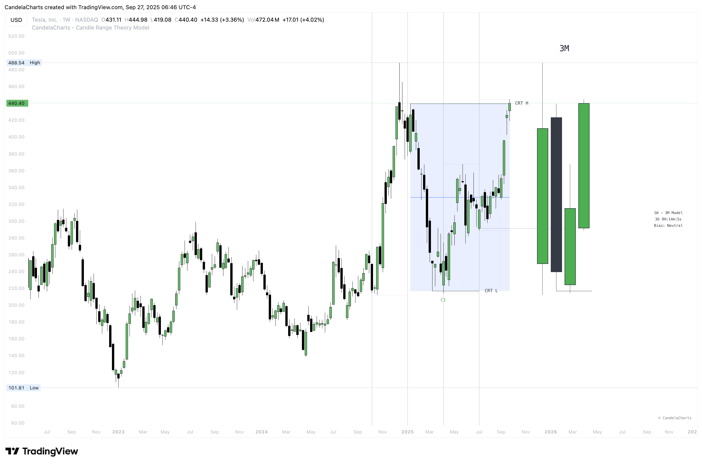
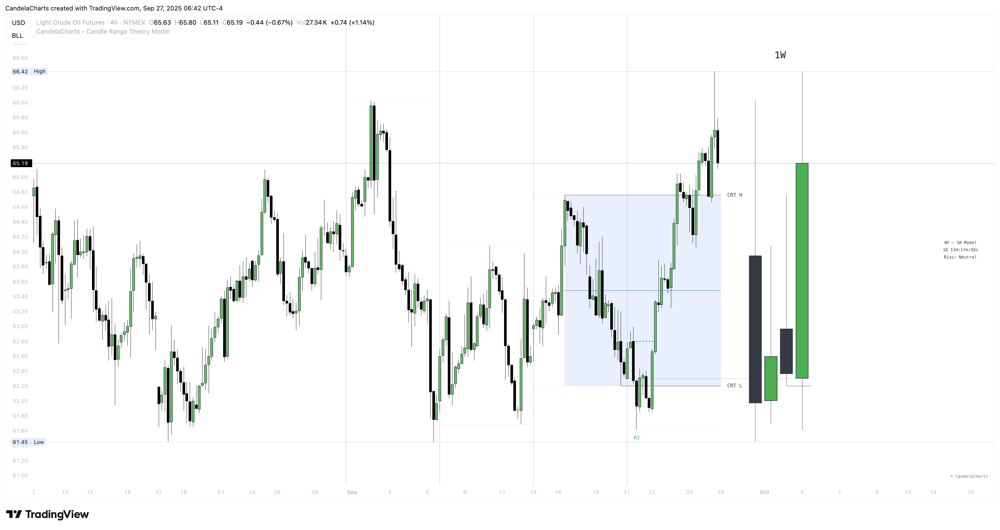
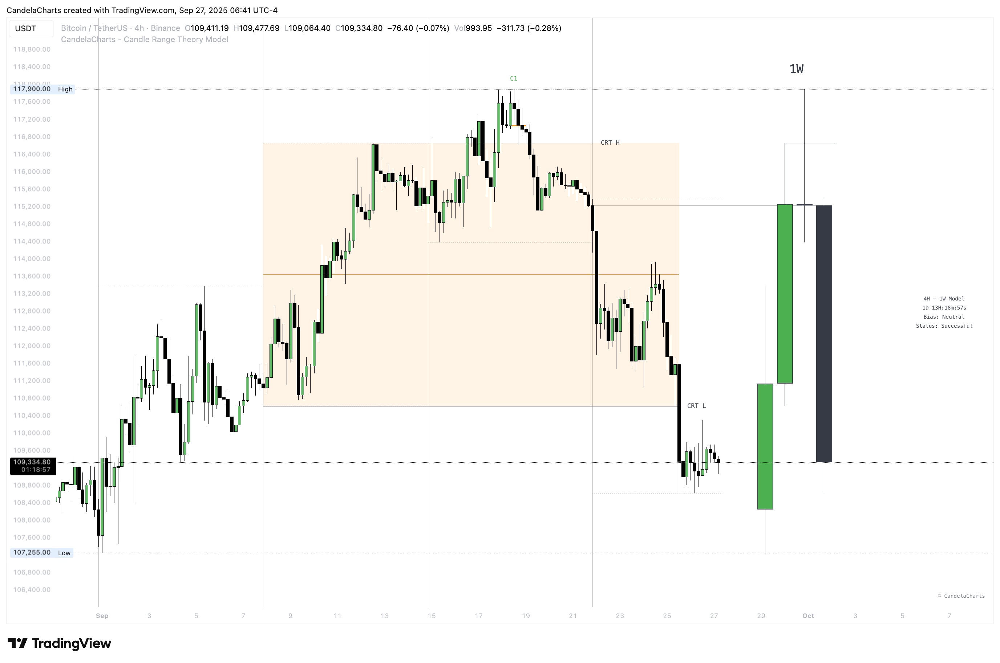

# Framework

A quick reminder helps you stay disciplined.

* **Don’t shotgun it:** Trying to trade every instance will fail over time.
* **Work from a higher-timeframe bias:** Build bias by either:
  * **Framing inside a higher-timeframe CRT Model:** Map the larger structure and execute within it.
  * **Using supporting concepts:** Price phases, equilibrium (0.5), and decisive candle closes to set and confirm direction.

**Bottom line:** The pattern is mechanical—**your edge is context**.

### Top-Down Analysis

This workflow keeps bias, plan, and entries speaking the same language.

#### Higher timeframe sets direction (1D / 1W / 1M)

Start with the daily, weekly, or monthly—whatever fits your style—to define bias. Do this by mapping a higher-timeframe CRT Model you’ll trade inside, or by using price phases, equilibrium, and strong closes to lock in direction.

#### Intermediate timeframe builds the plan (4H / 1H)

Drop to 4H/1H to validate bias and sketch structure. Look for a **Change in the State of Delivery (CISD)**, mark **points of interest (POIs)** that align with bias, and wait for proof at the level—a reaction, decisive close, or a **protected swing**.

#### Lower timeframe executes with precision (15M / 5M)

Use 15M/5M to refine entries and improve R:R. After the intermediate reaction/close, require a confirming **CISD** so all timeframes agree. Trigger on new protected highs/lows or continuation **order blocks (OBs)**, place stops beyond the protected high/low, and target higher-timeframe objectives.

### Expansion Candles

Set expectations so you don’t fight the tape.

* **Shallow pullbacks, fast legs:** Expansions retrace lightly and move with intent.
* **Half-range tendency:** Bullish expansions operate in the upper half; bearish in the lower half.
* **Context first:** Trade with the HTF bias, not every isolated print.

### Phases of Price

<figure><figcaption></figcaption></figure>

Label where you are so your actions stay consistent.

* **Reversal:** Initial turn that shifts delivery.
* **Expansion:** Impulsive leg in the new direction.
* **Retracement:** Pause/pullback—often shallow in expansions.
* **Consolidation:** Range digestion before the next leg.

### Mean / Equilibrium (0.5)

Use the midpoint to keep bias simple and objective.

<figure><figcaption></figcaption></figure>

#### Understanding the Mean

During expansions, pullbacks are usually shallow—treat **0.5** as the midline:

* Hold **upper half** → bias **higher**.
* Hold **lower half** → bias **lower**.
* If the respected half **fails**, flip bias and look for the opposite side of the range.

#### Applying the Mean in Expansions

In bullish expansions, the **upper half** often acts as support; in bearish expansions, the **lower half** often acts as resistance. If that behavior breaks, reassess your bias.

### Candle Wicks

Wicks often carry the signal; bodies tell the story after the fact.

#### What they indicate

* **Lower wick:** Drive down bought back up → bullish hint.
* **Upper wick:** Drive up sold back down → bearish hint.
* Strong reversal wicks often print a clear **“V”** on lower timeframes.

#### The 50% rule of a wick

Mark the wick midpoint (body→high for upper wick, body→low for lower wick):

* **Respect:** Holding the wick’s 0.5 favors continuation **against** the wick’s direction (lower-wick → up; upper-wick → down).
* **Disrespect:** Closing **through** the wick’s 0.5 often **invalidates** it and continues the original impulse.

Prioritize wicks that tag an **FVG** or sweep a key high/low; de-prioritize wicks formed entirely inside noisy internal ranges.

### Trading Candle 2 (The Reversal)

Use Candle 2’s wick, body, and context to judge whether the next leg trends or mean-reverts.

<figure><figcaption></figcaption></figure>

#### Expansion vs. reversal

* **Expansion candle:** Small wicks, strong body, one-way momentum.
* **Reversal (Candle 2):** Drives opposite, prints a long opposing wick, closes near open—context decides if it’s tradable.

**Key idea:** Small wicks favor continued expansion; large wicks often cap expansion because the range was “spent” building the wick.

#### Why wick size matters

* **Small-wick reversal:** More “runway”—target prior highs/lows, liquidity pools, standard-deviation projections.
* **Large-wick reversal:** Range consumed—expect mean-reversion toward the open or session extremes.

Think of wick size as a **fuel gauge**: less wick → more potential.

#### Correlated markets & SMT

Use related instruments for confirmation. If one market sits at a clean reversal but a correlated market is clearly stronger/weaker, prioritize the one that aligns with your bias to avoid false **CISD** and improve signal quality.

**Candle 2 takeaways**

* Small wick → more expansion potential.
* Large wick → tighter targets; continuations often follow **the next day** after a large-wick reversal.
* Always size expectations by wick size and session context.

### Trading Candle 3 (The Continuation)

Candle 2 flips bias; Candle 3 aims to capture the follow-through (Candle 4 often offers secondary continuation).

<figure><figcaption></figcaption></figure>

#### The key concept: wick size & expansion

Wick size on Candle 2 decides the play:

* **Small wick →** you can trade **Candle 2** directly.
* **Large wick →** let Candle 2 **close** and trade **Candle 3** instead.

#### When Candle 3 isn’t ideal

Avoid chasing weak continuations:

* If Candle 2 already expanded hard, Candle 3 can become a chase into retrace/chop.
* Demand extra LTF confluence: **protected swings**, **SMT divergence**, and multiple continuation cues aligning.

**Candle 3 takeaways**

* Wick size decides **Candle 2 vs. Candle 3**.
* Confirm with **CISD**, **FVG/OB**, and **protected swings**.
* Don’t chase after a big Candle 2—wait for alignment.

### Why Continuations Fail

Continuations often fail not because of an incorrect bias, but due to poor **structure** and **timing**. To avoid low-quality entries and unnecessary losses, traders must learn to identify consolidation traps, liquidity sweeps, and higher timeframe (HTF) objectives.

#### The Anatomy of an Ideal Continuation

A high-probability continuation is decisive. It isn't subtle; it is fast and clear.

* **Reaction:** Price reaches a Point of Interest (POI)—like a Fair Value Gap (FVG) or a swept low—and responds with an aggressive V-shaped reversal.
* **Displacement:** The reversal quickly closes through opposing candles, signaling that price has no interest in trading deeper.
* **Protection:** When price behaves this way, the resulting swing high or low becomes "protected," allowing for a confident entry.

#### Reason 1: Consolidation Disguised as Continuation

The most frequent cause of failure is mistaking sideways drift for a trend resumption.

* **The Trap:** Price fails to recover quickly and instead grinds sideways. A close through opposing candles during this phase is often a **manipulation** rather than a breakout.
* **The Outcome:** Price rotates to the opposite side of the range, stopping out early entrants.
* **The Solution:** Patience. If you don't see a clean V-shaped recovery, wait. If price trades back through the range, the original idea is invalid, and the range extremes become your new POIs.

**Handling Consolidations Correctly**

Stop trading "continuations" inside the noise. Instead, wait for:

1. A **manipulation/sweep** of the range.
2. A clear **breakout** followed by structural confirmation.

#### Reason 2: Liquidity Sweeps and Short-Term Targets

Continuations often fail when they form exactly as price hits a short-term target.

* **The Risk:** Liquidity sweeps often signal a pause, reversal, or transition. Entering immediately after a sweep—even with the right HTF bias—is structurally risky.
* **The Strategy:** Wait for a "confirmation continuation." Let price prove it intends to move further by respecting new FVGs or opposing candles _after_ the sweep. If it fails and rotates back, your original entry would have been premature.

#### Reason 3: HTF Objectives Have Been Met

Expansion into a major HTF objective (previous highs/lows or major POIs) is where price is most likely to reverse or enter a deep consolidation.

* **Late Entries:** Even a "clean" looking setup at an HTF target offers poor risk-to-reward.
* **Capital Preservation:** Accepting that a move is finished is essential. Missing a late-stage move is better than funding a reversal.

#### Speed, Timing, and the "One Candle" Rule

**Speed defines intent.** The best continuations form within **one to three candles** and show immediate displacement. If price takes too long to reclaim a level, the structure is weak and likely a consolidation in disguise. **The Power of Waiting One More Candle:** Waiting for a single additional candle is the most effective filter in trading. It reveals if the expansion is genuine, if the structure is protected, and if liquidity has truly been cleared.


Strong continuations are **fast, clean, and well-located**. Weak continuations hesitate, overlap, and form at exhausted price levels. Focus on setups that display clear intent and structural protection rather than trying to catch every move in the market.


### The Best Timeframes

This Fractal Range Model is a repeatable framework designed to identify clean expansion setups by aligning three specific timeframes. Whether you are trading high-level daily trends or intraday volatility, the logic remains identical across different timeframe hierarchies.

#### Timeframe Hierarchies

The model works best using these two specific combinations:

1. **Swing/Day Trading:** Daily (Bias) → 4-Hour (Structure) → 15-Minute (Execution)
2. **Scalping/Intraday:** 4-Hour (Bias) → 1-Hour (Structure) → 5-Minute (Execution)

#### Phase 1: Establishing the Bias (The Anchor)

Everything begins with the anchor timeframe (**Daily** or **4H**). We look for a **Candle to Closure** (Candle 2) at a significant Point of Interest (POI), such as a prior high/low or a Fair Value Gap (FVG).

* **The Setup:** A candle close through a POI signals acceptance.
* **The Goal:** Once Candle 2 closes, we anticipate the following candle—**Candle 3**—to be the expansion phase. This is the period we intend to trade.
* **Trading the Body:** We allow the opening wick to form first, then trade the expansion of the candle body toward the target.

#### Phase 2: Defining Structure (The Bridge)

With the bias established, the middle timeframe (**4H** or **1H**) helps us define intraday swing points and time the completion of the anchor candle's wick.

* **Evidence of Intent:** We look for a closure on this timeframe that aligns with our anchor bias. This often appears as an engulfing candle or a liquidity sweep followed by strong displacement.
* **Timing the Wick:** This closure confirms that the "wick" of the higher timeframe is likely finished, and the market is ready to expand toward HTF liquidity.

#### Phase 3: The Fractal Nature of Wicks

The model relies on the completion of the "wick" phase at every level before the "expansion" phase begins:

1. **Anchor (Daily/4H):** Wick forms, then the body expands.
2. **Bridge (4H/1H):** Wick forms, then the body expands.
3. **Execution (15m/5m):** Wick forms, then the body expands.

#### Phase 4: Execution (The Entry)

On the lowest timeframe (**15m** or **5m**), we do not catch the absolute reversal. We look for **Confirmation through Continuation**.

1. **Reaction:** Price reacts from a POI, sweeps short-term liquidity, and shows sharp displacement.
2. **The Trigger:** A closure confirms a change in delivery, creating a **Protected Swing**.
3. **The Entry:** Take the entry on the next continuation candle.
4. **Risk Management:**
   * **Stop Loss:** Placed beyond the protected swing.
   * **Targets:** A fixed 2:1 Reward-to-Risk (RR) or higher timeframe objectives (equal highs/lows or liquidity pools).

#### Advanced Alignment: The "Synchronized Expansion"

The most explosive opportunities occur when all three timeframes (**Daily/4H/15m** or **4H/1H/5m**) are expanding in the same direction simultaneously. By using a tight execution timeframe invalidation to target anchor timeframe liquidity, you can achieve superior risk-to-reward ratios.


This approach replaces guesswork with structural evidence. By starting with the Anchor for bias, using the Bridge to define the swing, and the Execution chart for precision, the path of least resistance becomes obvious. When all layers align, the trade is no longer a prediction—it is a confirmation.


Lead with context, not the pattern: set a clear higher-timeframe bias, then sync the intermediate and lower timeframes to it. Let equilibrium (0.5) and the C-area define where you expect reactions or follow-through, and time entries with CISD, wick-50% respect, and PD arrays—if alignment breaks, respect the invalidation and wait for the next clean continuation.
