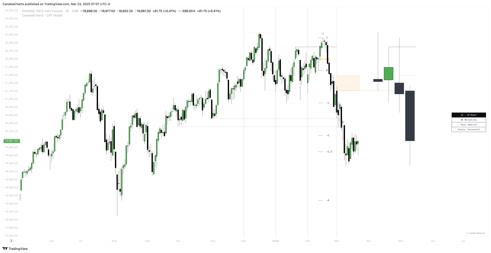

# Projections

Once a model is formed, the **Candle Range Theory (CRT) Model** automatically generates projection levels based on standard deviations.

<figure><figcaption></figcaption></figure>

These projections are calculated from the CISD Low to the CISD High, offering a dynamic view of potential price movement and volatility.

The projections provide traders with valuable insights into possible future price ranges, assisting in trade planning and decision-making.

### Customization

The projections can be anchored to either the body or the wicks of the CISD High and CISD Low, giving traders flexibility in how they interpret the model’s projected price levels.

* **Body Anchoring**: Using the body of the CISD High or Low focuses on the central price area, offering a more conservative and stable projection.
* **Wick Anchoring**: Using the wicks of the CISD High or Low captures the full range of price movement, accounting for potential volatility and broader market fluctuations.

This flexibility allows traders to adjust their projections based on their preferred risk profile and trading strategy.

### Purpose

The CRT Model's automatic projection levels are essential for understanding market potential after a model has formed.

These projections not only indicate possible price targets but also guide traders in assessing market behavior and making informed decisions.

Whether for planning exits, managing risk, or evaluating trends, these projections are a core feature of the model’s functionality.
