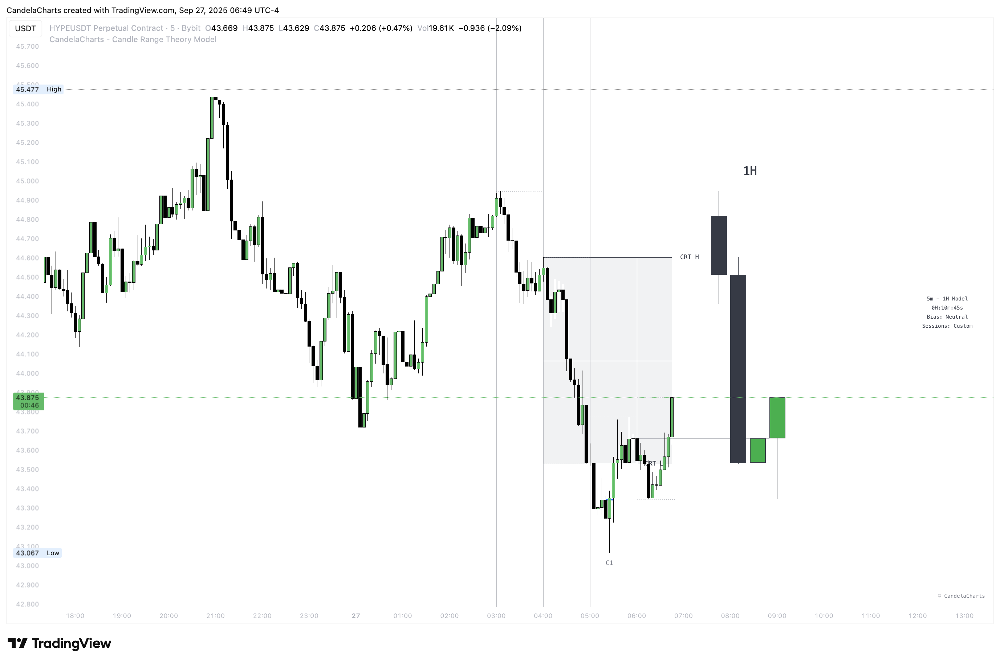

# Time Filter

The Candle Range Theory (CRT) Model incorporates various times when the CRT can occur, each designed to analyze market trends at different levels of granularity.

<figure><figcaption></figcaption></figure>

These specific times enable traders and investors to capture key price movements and shifts in market dynamics, offering insights across both short-term and long-term perspectives.

The CRT model supports the following times when the CRT can happen:

### 4-Hour CRT

<table><thead><tr><th width="163.7265625"></th><th></th></tr></thead><tbody><tr><td>1-5-9 (AM/PM)</td><td>Captures early market trends setting the tone for the trading day.</td></tr><tr><td>2-6-10 (AM/PM)</td><td>Analyzes market shifts after the early session and pre-midday changes.</td></tr></tbody></table>

### 1-Hour CRT

<table><thead><tr><th width="163.234375"></th><th></th></tr></thead><tbody><tr><td>8-9-10 (AM/PM)</td><td>Reflects late-market movements, influenced by global markets' closing.</td></tr><tr><td>2-3-4 (AM/PM)</td><td>Focuses on overnight consolidation and early morning trend shifts.</td></tr><tr><td>7-8-9 (AM/PM)</td><td>Tracks early morning market activity before the official opening.</td></tr></tbody></table>

By using these pairings, the CRT provides a comprehensive framework for market analysis across multiple timeframes, enabling users to adapt their approach based on specific trading objectives.
