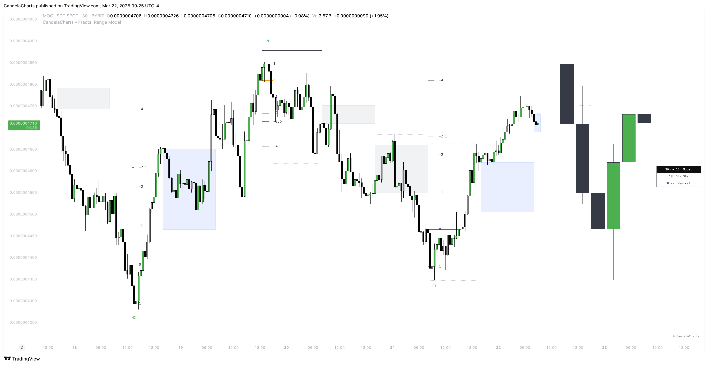

# Fractal Range Model™

The **Fractal Range Model (FRM)** is an all-encompassing and sophisticated trading framework that incorporates multiple market dynamics to provide a deeper understanding of price movements.

<figure><figcaption></figcaption></figure>

This model is built around several key principles, including **Market Swing Points**, **Sweeps**, **Candle Mean**, and **Change in State of Delivery (CISD)**, which together offer a nuanced and effective approach to trading.


* This model is designed for educational and analytical purposes to study market structure, trends, and price behavior.
* It does not provide trading signals and should not be used as a substitute for independent analysis or proper risk management.
* The model is timeframe - and symbol-agnostic, automatically adapting to any market, asset, or chart it is applied to.

