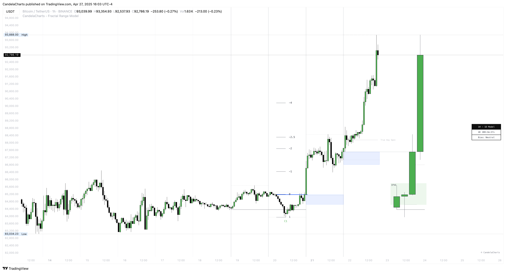

# C-area

<figure><figcaption></figcaption></figure>

### **Definition**

The **C-Area** refers to the price zone between the **opening price of the current candle** and the **midpoint of the previous candle's range**. It provides insight into early price positioning relative to the prior session’s balance and can serve as a contextual reference for potential intraday direction or rejection zones.

### Formation

* **Bullish C-Area** (MMXM Buy Model)**:** Occurs when the current candle opens _above_ the midpoint of the previous candle. The C-Area is defined as the price range **from the open of the current candle down to the midpoint** of the previous candle.
* **Bearish C-Area** (MMXM Sell Model)**:** Occurs when the current candle opens _below_ the midpoint of the previous candle. The C-Area is defined as the price range **from the open of the current candle up to the midpoint** of the previous candle.

### Interpretation

When price trades into the C-Area and **respects** the previous candle’s midpoint (i.e., shows rejection or consolidation without violating the zone), this confirms alignment with the respective MMXM directional model:

* In a **Bullish C-Area**, holding above the mean often precedes upward continuation.
* In a **Bearish C-Area**, rejection from the mean typically signals renewed downside pressure.

### Invalidation

* **Bullish C-Area Invalidation:** A bullish setup is considered invalidated if the **current candle closes above** the midpoint of the previous candle. This may signal stronger upward momentum, negating the significance of the C-Area as a bearish resistance zone.
* **Bearish C-Area Invalidation:** A bearish setup is invalidated if the **current candle closes above** the midpoint of the previous candle. This close above may indicate a rejection of lower prices or a failed bearish attempt.
