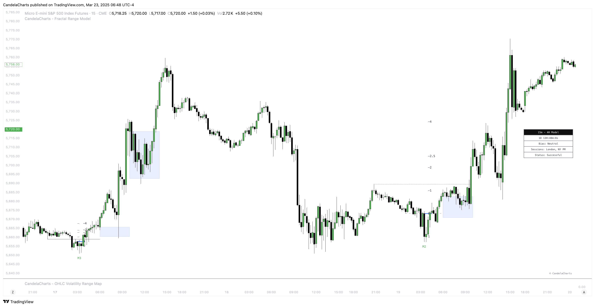

# Dashboard

The **Fractal Range Model (FRM) Dashboard** provides traders with essential, real-time information to help guide their decision-making and improve market analysis.&#x20;

<figure><figcaption></figcaption></figure>

The dashboard is designed to display key data points, offering a comprehensive view of the current market conditions and the state of the chart.&#x20;

The following key metrics are displayed:

1. **Bias**: This section indicates the overall **market bias** based on the current model and time frame. It helps traders quickly assess whether the market is trending bullish, bearish, or neutral, providing a clear directional view. Understanding the market bias helps traders align their strategy with the prevailing market conditions.
2. **Current Model**: The dashboard highlights the **current model** that has been identified by the Fractal Range Model, such as a **Sweep** or **CISD** (Change In Structure Direction). This allows traders to instantly know which market structure is currently in play, helping them understand the underlying market dynamics and potential opportunities.
3. **Remaining Time Until HTF Candle Close**: The dashboard also displays a countdown showing the **remaining time until the higher time frame (HTF) candle closes**. This feature provides traders with valuable insight into the time left for the current candle to complete, helping them time entries, exits, or model validations more effectively. It’s particularly useful for those trading higher time frames and needing to make decisions based on the closure of key candles.
4. **Sessions Filter:** This filter allows users to view trading data within specific market sessions (Killzones).
5. **Model Status Filter:** This filter enables users to focus on specific states or conditions of the trading model.

The **FRM Dashboard** delivers a streamlined view of critical information, including the **market bias**, the **current model**, and the **remaining time until the HTF candle closes**.&#x20;

By consolidating these key data points, traders can make more informed decisions, enhancing their ability to navigate market conditions with greater confidence and precision.
