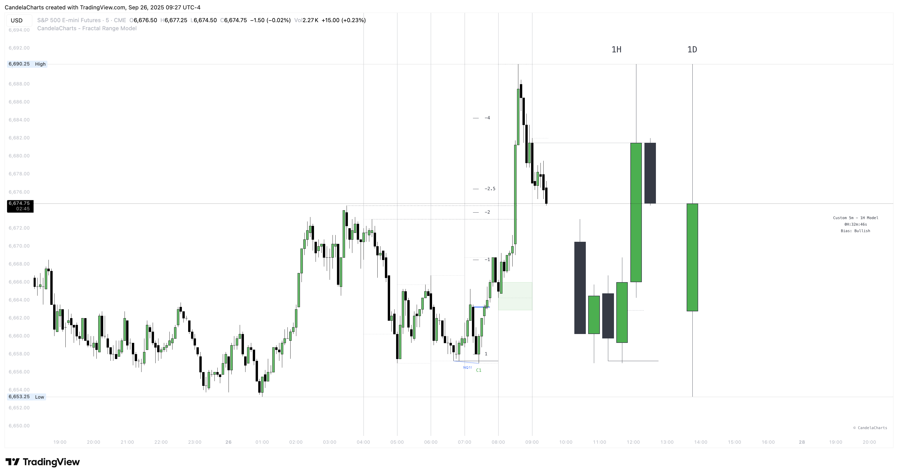
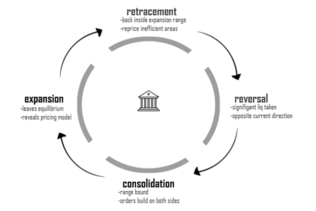
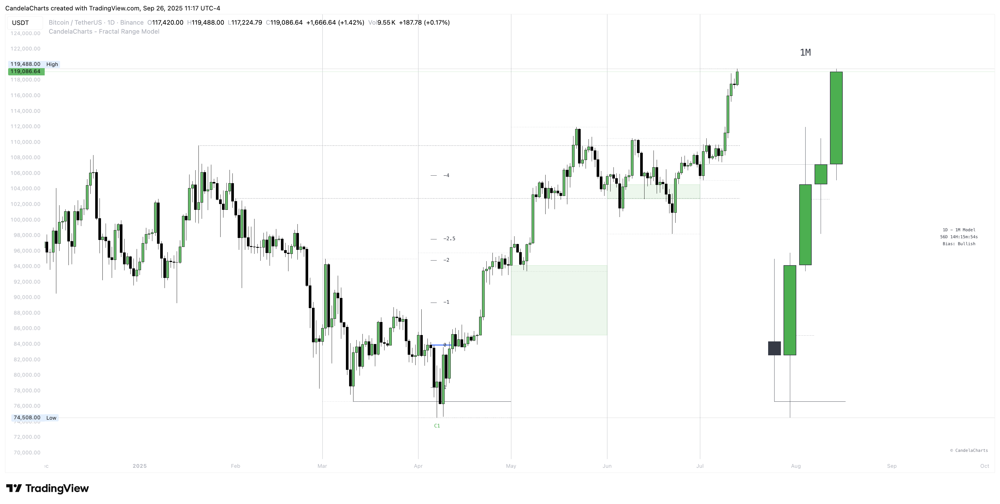

# Framework

The **Fractal Range Model** is a mechanical, repeatable pattern in the market. Where many traders go wrong is trying to pattern-trade every occurrence they see. That shotgun approach isn’t sustainable and will fail over the long run.

To use the model effectively, trade only with a **clear higher-timeframe bias**. You can establish that bias by either:

* **Framing within a higher-timeframe Fractal Range Model:** Identify the larger structure and execute inside it.
* **Applying supporting concepts:** Use phases of price, equilibrium, and candle closures to define direction and confirm context.

In short: the pattern is mechanical—your edge comes from context.

### Top Down Analysis

This quick walkthrough gives you a clean, repeatable way to align bias, planning, and execution.

#### Higher timeframe sets direction (1D / 1W / 1M)

Pick the daily, weekly, or monthly—whatever matches your style—to define directional bias. Do this by either mapping a higher-timeframe **Fractal Range Model** you’ll trade inside, or by using supporting concepts (price phases, equilibrium, and candle closures) to lock in a clear bias.

#### Intermediate timeframe builds the plan (4H / 1H)

Move down to 4H/1H to sketch structure and validate the bias. Confirm with a **Change in the State of Delivery (CISD)**, mark **points of interest (POIs)** that align with the bias, and wait for proof at the level—a reaction, decisive candle close, or formation of a **protected swing**.

#### Lower timeframe executes with precision (15M / 5M)

Use 15M/5M to refine entries and improve your risk-to-reward. After the intermediate reaction/close, look for a confirming **CISD** so all three timeframes speak the same language. Trigger entries on **new protected highs/lows** or **continuation order blocks** in your direction, place stops beyond the protected high/low, and target higher-timeframe objectives.

<figure><figcaption></figcaption></figure>

### Expansion Candles

This brief overview describes how expansions behave and how to set realistic expectations.

* **Shallow pullbacks, fast legs:** Expansion phases often retrace only lightly and move aggressively in the trend direction.
* **Half‑range tendency:** In a bullish expansion, price frequently operates in the **upper half** of the range; in a bearish expansion, in the **lower half**.
* **Context first:** The goal is to trade **with** the higher‑timeframe bias, not to chase every pattern print.

### Phases of Price&#x20;

<figure><figcaption></figcaption></figure>

Typical cycle elements you’ll observe include:

* **Reversal** – the initial turn that shifts delivery.
* **Expansion** – the impulsive leg in the new direction.
* **Retracement** – a pause or pullback that often remains shallow in expansions.
* **Consolidation** – a range‑bound phase that can precede the next move.


**Mean or Equilibrium (0.5):** The midpoint of your chosen range is a key reference. During expansions, reactions frequently occur around this level without deep discount (bullish) or premium (bearish) retracements.


### Understanding Mean

<figure><figcaption></figcaption></figure>

When the market is expanding, pullbacks are typically shallow. So rather than waiting for deep discount/premium tests, we read 0.5 as a midline:

* **Upper half respected →** bias to trade **higher**.
* **Lower half respected →** bias to trade **lower**.&#x20;

If the respected half fails, we can **flip bias** and anticipate the opposite side of the range to be taken.

#### Applying Equilibrium in Expansions

* In a **bullish** expansion, the **upper half** of the candle/range often acts as **support** for continuation.
* In a **bearish** expansion, the **lower half** often acts as **resistance** for continuation. If these levels do not respect, reassess the bias.

### Understanding C-area

The **C-area** is a rules‑based zone derived from higher‑timeframe (HTF) structure that highlights where the next HTF candle is likely to wick during **expansions**. It blends **Mean** (equilibrium) logic, decisive candle closures, and trend shifts to give a clean, repeatable focus area.

<figure><figcaption></figcaption></figure>

**Definition**

The **C-area** is the price zone between the current candle's open and the previous candle's midpoint (0.5 of its range). It highlights early positioning relative to the prior candle's balance and acts as a contextual reference for potential intraday continuation or rejection.

**Formation**

* **Bullish C-area:** The C-area spans from the current open **down** to previous candle equilibrium.
* **Bearish C-area:** The C-area spans from the current open **up** to previous candle equilibrium.


The C-areas can also be interpreted as the MMXM Model, as they often emphasize MMSM and MMBM accumulation zones.


**Interpretation**

* When price trades into the C-area and **respects** the prior midpoint (rejects or consolidates without violating it), it supports the respective MMXM directional model.
  * In a **bullish C-area**, holding **above** the prior midpoint often precedes upward continuation.
  * In a **bearish C-area**, rejection **from** the prior midpoint typically signals renewed downside pressure.


Inside the C-area, locate a **Fair Value Gap (FVG)**, **Order Block (OB)**, **Breaker**, or a comparable point of interest that can serve as entry.


**Invalidation**

* **Bullish C-area:** A decisive close **below** the previous candle's midpoint (loss of mean support).
* **Bearish C-area:** A decisive close **above** the previous candle's midpoint (loss of mean resistance).

### Candle Wicks

Candlestick wicks often carry more signal than the body. Read correctly, they reveal rejection from key levels and can mark turning points—especially when you align higher and lower timeframes.

#### What Wicks Indicate

* A **lower wick** shows an aggressive drive down that was bought back up before close → a **bullish** hint.
* An **upper wick** shows an aggressive drive up that was sold back down before close → a **bearish** hint. In short, wicks are **mini‑reversals on lower timeframes**.


**Pro tip:** A strong reversal candle with a large wick usually prints a clear **“V”** shape on the lower timeframe.


#### The 50% Rule of a Wick

* **Mark the wick midpoint:** From body → high (upper wick) or body → low (lower wick).
* **Respect:** If price **holds** the 0.5 of the wick, continuation is favored **against** the wick’s direction (i.e., lower‑wick → up; upper‑wick → down).
* **Disrespect:** If price **closes through** the 0.5 of the wick, the wick is likely invalidated and price may continue **with** the original impulse.


**Pro tip:** Prioritize wicks that tag a **Fair Value Gap (FVG)** or **take a key high/low**. De‑prioritize wicks that form entirely inside a noisy internal range.


### Trading Candle 2
