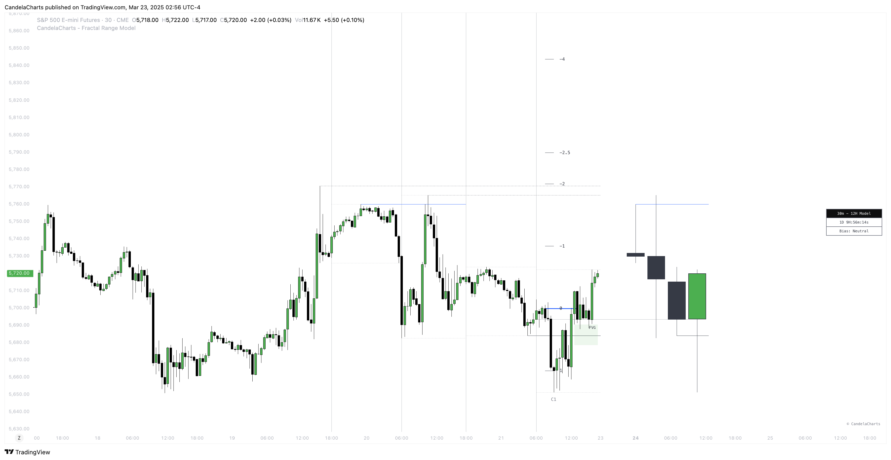
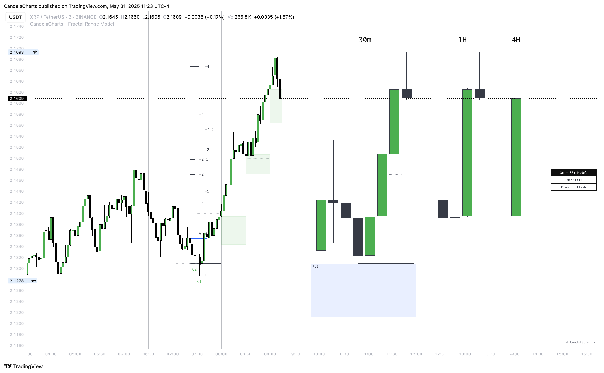
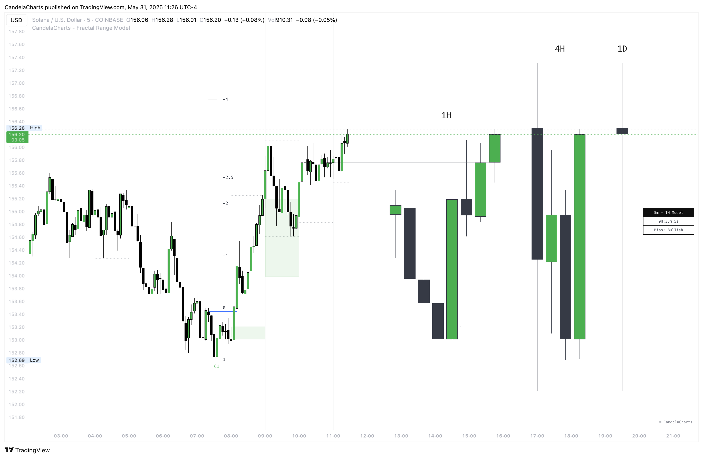

# Framework

The **Fractal Range Model** is an advanced trading framework that programmatically detects, visualizes, and invalidates key market concepts such as **Sweeps**, **CISD**, **Projections**, **Liquidity Levels**, **SMT Divergences**, **PD Arrays**, and more.

Designed to streamline the trading process, this model integrates multiple components to offer a comprehensive view of the market, helping traders identify key entry and exit points.

## **When to Enter a Trade**

After the **Fractal Range Model** has formed and key components like **Sweep** and **CISD** have been detected, traders can look for entry opportunities based on additional technical signals. The goal is to align the model's formation with other structural clues to optimize the timing of trade entries. Here's a breakdown of when to enter:

### **1. Entry Based on LTF PD Arrays**

Once the model is formed and **Sweep** and **CISD** have been established, the next step is to check for **Low-Timeframe (LTF) PD Arrays**. These arrays are key areas of liquidity or price structure that can give further confirmation for an entry.

<figure><figcaption></figcaption></figure>

If a **LTF PD Array** is present, traders can place their position in line with this array, as it serves as a strong zone of potential price reversal or continuation.

* **Action**: Look for LTF PD Arrays that align with the Fractal Range Model’s structure.
* **Entry**: If the array provides confluence, place the position near the array with a stop loss below the array zone.

### **2. Entry Using CISD**

If no **LTF PD Arrays** are present, the next best entry signal comes from the **CISD**.&#x20;

<figure><figcaption></figcaption></figure>

When the **CISD** aligns with the model's structure, it can serve as an entry point, signaling that the market is likely to follow the predicted path set by the Fractal Range Model.

* **Action**: Look for a **CISD** that aligns with the broader model and the price structure.
* **Entry**: Place a position near the **CISD** zone, ensuring that the stop loss is set appropriately based on the model's invalidation rules.

### **3. Missed Entries: First C-Area Level**

If a trader misses an entry at the **CISD** or **LTF PD Array**, the next opportunity for entry is at the **first C-Area level**.&#x20;

<figure><figcaption></figcaption></figure>

The **C-Area** represents a critical zone where price action is likely to consolidate, and traders should look for volume confirmation and a lack of divergences for a valid entry.

* **Action**: Wait for price to approach the **first C-Area** level, ensuring that there is consolidation and strong volume present.
* **Confirmation**: Confirm that there are no divergences (e.g., no bearish or bullish divergences that would contradict the price movement). This ensures that the price action is in alignment with the model’s projection.
* **Entry**: If the above conditions are met, place the entry with a stop loss at the end of the **C-Area** zone.
