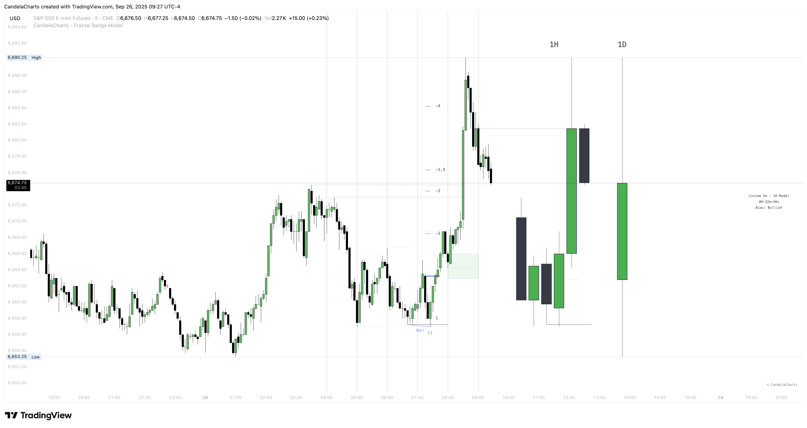
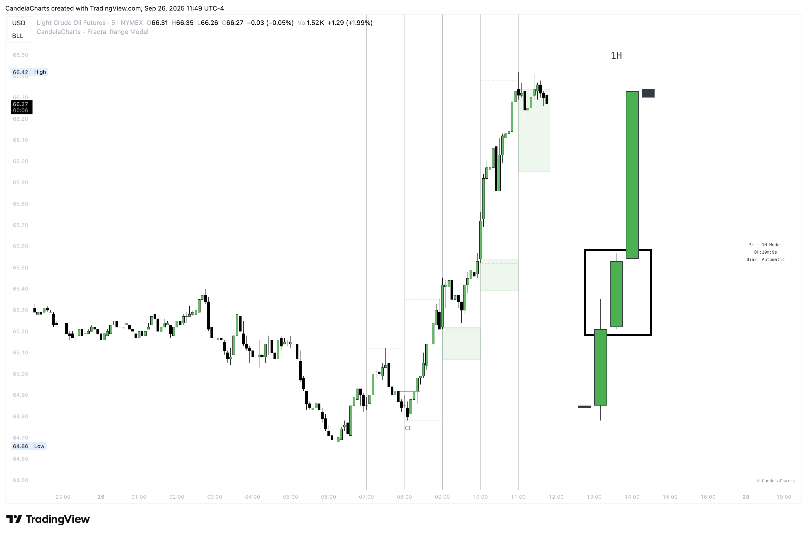
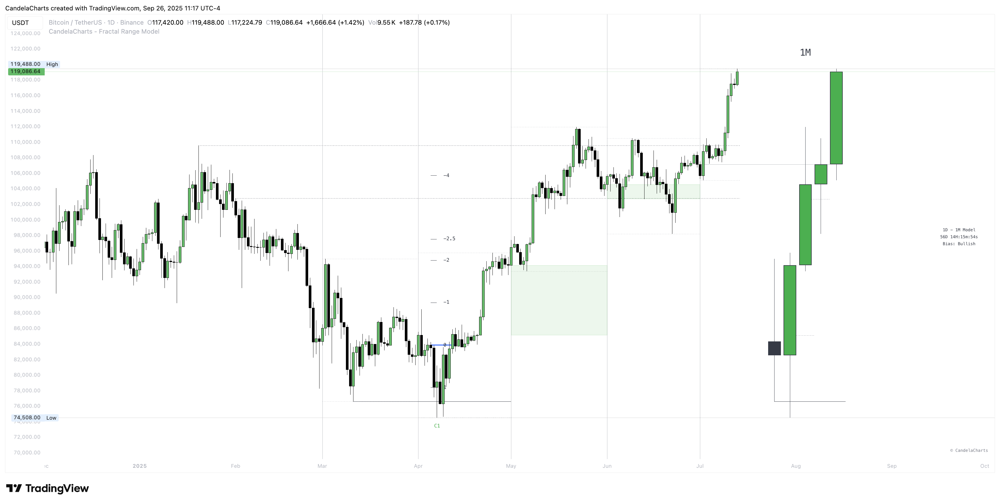
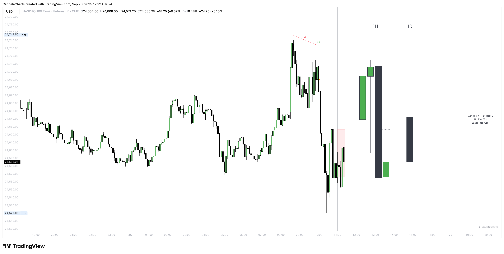
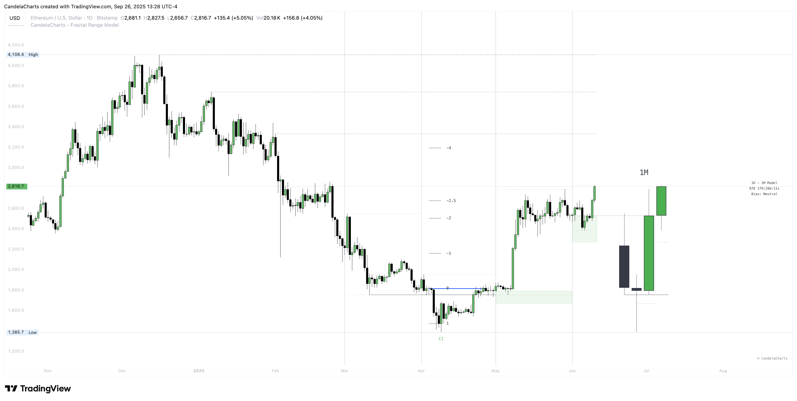

# Framework

The **Fractal Range Model** is a mechanical, repeatable pattern in the market. Where many traders go wrong is trying to pattern-trade every occurrence they see. That shotgun approach isn’t sustainable and will fail over the long run.

To use the model effectively, trade only with a **clear higher-timeframe bias**. You can establish that bias by either:

* **Framing within a higher-timeframe Fractal Range Model:** Identify the larger structure and execute inside it.
* **Applying supporting concepts:** Use phases of price, equilibrium, and candle closures to define direction and confirm context.

In short: the pattern is mechanical—your edge comes from context.

### Top Down Analysis

This quick walkthrough gives you a clean, repeatable way to align bias, planning, and execution.

#### Higher timeframe sets direction (1D / 1W / 1M)

Pick the daily, weekly, or monthly—whatever matches your style—to define directional bias. Do this by either mapping a higher-timeframe **Fractal Range Model** you’ll trade inside, or by using supporting concepts (price phases, equilibrium, and candle closures) to lock in a clear bias.

#### Intermediate timeframe builds the plan (4H / 1H)

Move down to 4H/1H to sketch structure and validate the bias. Confirm with a **Change in the State of Delivery (CISD)**, mark **points of interest (POIs)** that align with the bias, and wait for proof at the level—a reaction, decisive candle close, or formation of a **protected swing**.

#### Lower timeframe executes with precision (15M / 5M)

Use 15M/5M to refine entries and improve your risk-to-reward. After the intermediate reaction/close, look for a confirming **CISD** so all three timeframes speak the same language. Trigger entries on **new protected highs/lows** or **continuation order blocks** in your direction, place stops beyond the protected high/low, and target higher-timeframe objectives.

<figure><figcaption></figcaption></figure>

### Expansion Candles

This brief overview describes how expansions behave and how to set realistic expectations.

* **Shallow pullbacks, fast legs:** Expansion phases often retrace only lightly and move aggressively in the trend direction.
* **Half‑range tendency:** In a bullish expansion, price frequently operates in the **upper half** of the range; in a bearish expansion, in the **lower half**.
* **Context first:** The goal is to trade **with** the higher‑timeframe bias, not to chase every pattern print.

### Phases of Price

<figure><figcaption></figcaption></figure>

Typical cycle elements you’ll observe include:

* **Reversal** – the initial turn that shifts delivery.
* **Expansion** – the impulsive leg in the new direction.
* **Retracement** – a pause or pullback that often remains shallow in expansions.
* **Consolidation** – a range‑bound phase that can precede the next move.


**Mean or Equilibrium (0.5):** The midpoint of your chosen range is a key reference. During expansions, reactions frequently occur around this level without deep discount (bullish) or premium (bearish) retracements.


### Understanding Mean

<figure><figcaption></figcaption></figure>

When the market is expanding, pullbacks are typically shallow. So rather than waiting for deep discount/premium tests, we read 0.5 as a midline:

* **Upper half respected →** bias to trade **higher**.
* **Lower half respected →** bias to trade **lower**.

If the respected half fails, we can **flip bias** and anticipate the opposite side of the range to be taken.

#### Applying Mean in Expansions

* In a **bullish** expansion, the **upper half** of the candle/range often acts as **support** for continuation.
* In a **bearish** expansion, the **lower half** often acts as **resistance** for continuation. If these levels do not respect, reassess the bias.

### Understanding C-area

The **C-area** is a rules‑based zone derived from higher‑timeframe (HTF) structure that highlights where the next HTF candle is likely to wick during **expansions**. It blends **Mean** (equilibrium) logic, decisive candle closures, and trend shifts to give a clean, repeatable focus area.

<figure><figcaption></figcaption></figure>

**Definition**

The **C-area** is the price zone between the current candle's open and the previous candle's midpoint (0.5 of its range). It highlights early positioning relative to the prior candle's balance and acts as a contextual reference for potential intraday continuation or rejection.

**Formation**

* **Bullish C-area:** The C-area spans from the current open **down** to previous candle equilibrium.
* **Bearish C-area:** The C-area spans from the current open **up** to previous candle equilibrium.


The C-areas can also be interpreted as the MMXM Model, as they often emphasize MMSM and MMBM accumulation zones.


**Interpretation**

* When price trades into the C-area and **respects** the prior midpoint (rejects or consolidates without violating it), it supports the respective MMXM directional model.
  * In a **bullish C-area**, holding **above** the prior midpoint often precedes upward continuation.
  * In a **bearish C-area**, rejection **from** the prior midpoint typically signals renewed downside pressure.


Inside the C-area, locate a **Fair Value Gap (FVG)**, **Order Block (OB)**, **Breaker**, or a comparable point of interest that can serve as entry.


**Invalidation**

* **Bullish C-area:** A decisive close **below** the previous candle's midpoint (loss of mean support).
* **Bearish C-area:** A decisive close **above** the previous candle's midpoint (loss of mean resistance).

### Candle Wicks

Candlestick wicks often carry more signal than the body. Read correctly, they reveal rejection from key levels and can mark turning points—especially when you align higher and lower timeframes.

#### What Wicks Indicate

* A **lower wick** shows an aggressive drive down that was bought back up before close → a **bullish** hint.
* An **upper wick** shows an aggressive drive up that was sold back down before close → a **bearish** hint. In short, wicks are **mini‑reversals on lower timeframes**.


A strong reversal candle with a large wick usually prints a clear **“V”** shape on the lower timeframe.


#### The 50% Rule of a Wick

* **Mark the wick midpoint:** From body → high (upper wick) or body → low (lower wick).
* **Respect:** If price **holds** the 0.5 of the wick, continuation is favored **against** the wick’s direction (i.e., lower‑wick → up; upper‑wick → down).
* **Disrespect:** If price **closes through** the 0.5 of the wick, the wick is likely invalidated and price may continue **with** the original impulse.


Prioritize wicks that tag a **Fair Value Gap (FVG)** or **take a key high/low**. De‑prioritize wicks that form entirely inside a noisy internal range.


### Trading Candle 2

Timing and structure matter as much as direction. In the **Fractal Range Model**, **Candle 2** is the reversal candle whose wick, body, and context tell you whether the next leg is likely to **trend** or merely **retrace**. When specific criteria are present, Candle 2 can also be traded directly.

<figure><figcaption></figcaption></figure>

#### Expansion vs. Reversal Candles

* **Expansion candle:** Small wicks on both ends, a strong body, and clear one‑way momentum during its period.
* **Reversal candle (Candle 2):** Opens, drives strongly the other way (creating a long opposing wick), and closes near its open—hinting at a shift in direction. Not every reversal is tradeable; context decides.


**Key takeaway:** Small wicks favor continued expansion; large wicks often cap expansion because much of the range was already consumed creating the wick.


#### Why Wick Size Matters

* **Small‑wick reversal:** Price hasn’t used much range to print the wick, so there’s room to run. Consider deeper targets: prior highs/lows, liquidity pools, and standard‑deviation projections.
* **Large‑wick reversal:** Much of the candle’s range was spent forming the wick. Expect mean‑reversion style movement (toward the open or session extremes) rather than a long trend leg.

_Think of wick size as a fuel gauge: less wick → more runway._

#### Correlated Markets & SMT

Use related instruments for confirmation and confluence. If one market sits at a clean reversal area but a correlated market is clearly stronger/weaker, prioritize the one that **aligns with your bias**. This helps avoid false CISD and improves signal quality.

#### Key takeaways

* **Small wick →** more potential for **range expansion**.
* **Large wick →** less potential; use tighter targets.
* Always size expectations by **wick size** and **session context**.
* Continuations frequently follow the day **after** a large‑wick reversal.

### Trading Candle 3

Candle 2 is the **reversal**, Candle 3 is the **continuation**, and Candle 4 often acts as a **secondary continuation**. Candle 3 aims to capture the directional move **after** the reversal has set the bias.

<figure><figcaption></figcaption></figure>

#### The Key Concept: Wick Size & Expansion

Wick size on **Candle 2** determines whether you trade the reversal itself or wait for continuation.

* **Small wick on Candle 2 →** more expansion potential → you can trade **Candle 2** directly.
* **Large wick on Candle 2 →** range already consumed → let Candle 2 **close** and trade **Candle 3** instead.


Small wick → trade Candle 2.\
Large wick → wait for Candle 3.


#### When Candle 3 Isn’t Ideal

Avoid low‑quality continuations:

* If **Candle 2** was already a strong **expansion**, Candle 3 may be a **chase** into retrace or chop.
* In such cases, demand extra confluence on LTF: protected swings, **SMT** divergence, or multiple continuation cues aligning.

### Why Continuations Fail

Continuations often fail not because of an incorrect bias, but due to poor **structure** and **timing**. To avoid low-quality entries and unnecessary losses, traders must learn to identify consolidation traps, liquidity sweeps, and higher timeframe (HTF) objectives.

#### The Anatomy of an Ideal Continuation

A high-probability continuation is decisive. It isn't subtle; it is fast and clear.

* **Reaction:** Price reaches a Point of Interest (POI)—like a Fair Value Gap (FVG) or a swept low—and responds with an aggressive V-shaped reversal.
* **Displacement:** The reversal quickly closes through opposing candles, signaling that price has no interest in trading deeper.
* **Protection:** When price behaves this way, the resulting swing high or low becomes "protected," allowing for a confident entry.

#### Reason 1: Consolidation Disguised as Continuation

The most frequent cause of failure is mistaking sideways drift for a trend resumption.

* **The Trap:** Price fails to recover quickly and instead grinds sideways. A close through opposing candles during this phase is often a **manipulation** rather than a breakout.
* **The Outcome:** Price rotates to the opposite side of the range, stopping out early entrants.
* **The Solution:** Patience. If you don't see a clean V-shaped recovery, wait. If price trades back through the range, the original idea is invalid, and the range extremes become your new POIs.

**Handling Consolidations Correctly**

Stop trading "continuations" inside the noise. Instead, wait for:

1. A **manipulation/sweep** of the range.
2. A clear **breakout** followed by structural confirmation.

#### Reason 2: Liquidity Sweeps and Short-Term Targets

Continuations often fail when they form exactly as price hits a short-term target.

* **The Risk:** Liquidity sweeps often signal a pause, reversal, or transition. Entering immediately after a sweep—even with the right HTF bias—is structurally risky.
* **The Strategy:** Wait for a "confirmation continuation." Let price prove it intends to move further by respecting new FVGs or opposing candles _after_ the sweep. If it fails and rotates back, your original entry would have been premature.

#### Reason 3: HTF Objectives Have Been Met

Expansion into a major HTF objective (previous highs/lows or major POIs) is where price is most likely to reverse or enter a deep consolidation.

* **Late Entries:** Even a "clean" looking setup at an HTF target offers poor risk-to-reward.
* **Capital Preservation:** Accepting that a move is finished is essential. Missing a late-stage move is better than funding a reversal.

#### Speed, Timing, and the "One Candle" Rule

**Speed defines intent.** The best continuations form within **one to three candles** and show immediate displacement. If price takes too long to reclaim a level, the structure is weak and likely a consolidation in disguise. **The Power of Waiting One More Candle:** Waiting for a single additional candle is the most effective filter in trading. It reveals if the expansion is genuine, if the structure is protected, and if liquidity has truly been cleared.


Strong continuations are **fast, clean, and well-located**. Weak continuations hesitate, overlap, and form at exhausted price levels. Focus on setups that display clear intent and structural protection rather than trying to catch every move in the market.


### The Best Timeframes

This Fractal Range Model is a repeatable framework designed to identify clean expansion setups by aligning three specific timeframes. Whether you are trading high-level daily trends or intraday volatility, the logic remains identical across different timeframe hierarchies.

#### Timeframe Hierarchies

The model works best using these two specific combinations:

1. **Swing/Day Trading:** Daily (Bias) → 4-Hour (Structure) → 15-Minute (Execution)
2. **Scalping/Intraday:** 4-Hour (Bias) → 1-Hour (Structure) → 5-Minute (Execution)

#### Phase 1: Establishing the Bias (The Anchor)

Everything begins with the anchor timeframe (**Daily** or **4H**). We look for a **Candle to Closure** (Candle 2) at a significant Point of Interest (POI), such as a prior high/low or a Fair Value Gap (FVG).

* **The Setup:** A candle close through a POI signals acceptance.
* **The Goal:** Once Candle 2 closes, we anticipate the following candle—**Candle 3**—to be the expansion phase. This is the period we intend to trade.
* **Trading the Body:** We allow the opening wick to form first, then trade the expansion of the candle body toward the target.

#### Phase 2: Defining Structure (The Bridge)

With the bias established, the middle timeframe (**4H** or **1H**) helps us define intraday swing points and time the completion of the anchor candle's wick.

* **Evidence of Intent:** We look for a closure on this timeframe that aligns with our anchor bias. This often appears as an engulfing candle or a liquidity sweep followed by strong displacement.
* **Timing the Wick:** This closure confirms that the "wick" of the higher timeframe is likely finished, and the market is ready to expand toward HTF liquidity.

#### Phase 3: The Fractal Nature of Wicks

The model relies on the completion of the "wick" phase at every level before the "expansion" phase begins:

1. **Anchor (Daily/4H):** Wick forms, then the body expands.
2. **Bridge (4H/1H):** Wick forms, then the body expands.
3. **Execution (15m/5m):** Wick forms, then the body expands.

#### Phase 4: Execution (The Entry)

On the lowest timeframe (**15m** or **5m**), we do not catch the absolute reversal. We look for **Confirmation through Continuation**.

1. **Reaction:** Price reacts from a POI, sweeps short-term liquidity, and shows sharp displacement.
2. **The Trigger:** A closure confirms a change in delivery, creating a **Protected Swing**.
3. **The Entry:** Take the entry on the next continuation candle.
4. **Risk Management:**
   * **Stop Loss:** Placed beyond the protected swing.
   * **Targets:** A fixed 2:1 Reward-to-Risk (RR) or higher timeframe objectives (equal highs/lows or liquidity pools).

#### Advanced Alignment: The "Synchronized Expansion"

The most explosive opportunities occur when all three timeframes (**Daily/4H/15m** or **4H/1H/5m**) are expanding in the same direction simultaneously. By using a tight execution timeframe invalidation to target anchor timeframe liquidity, you can achieve superior risk-to-reward ratios.


This approach replaces guesswork with structural evidence. By starting with the Anchor for bias, using the Bridge to define the swing, and the Execution chart for precision, the path of least resistance becomes obvious. When all layers align, the trade is no longer a prediction—it is a confirmation.


### Key Takeaways

* **Wick size** decides: trade **Candle 2** (small wick) vs. **Candle 3** (large wick).
* Candle 3 captures **expansion** after the reversal.
* Always confirm with **CISD**, **FVG/OB**, and **protected swings**.
* Don’t chase Candle 3 after a big Candle 2 expansion—wait for cleaner continuation context.
* The best setups come from **multi‑timeframe continuation alignment**.

Context over pattern: establish a clear higher-timeframe bias, then align the intermediate and lower timeframes so they’re speaking the same language. Let equilibrium (0.5) and the C-area frame where you expect reaction or follow-through, and use CISD, wick-50% respect, and PD arrays to time entries—if alignment breaks, honor invalidation and wait for the next clean continuation.
