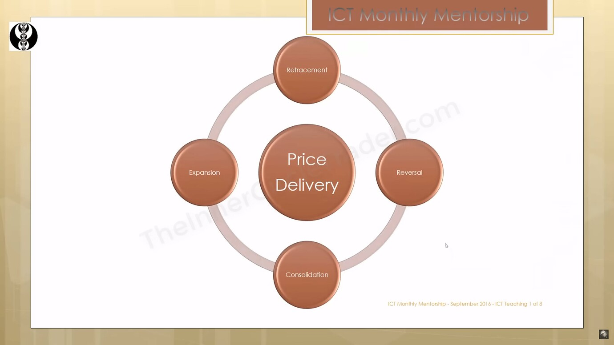
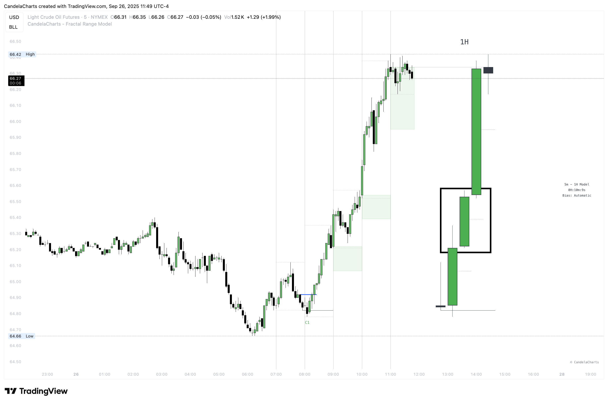
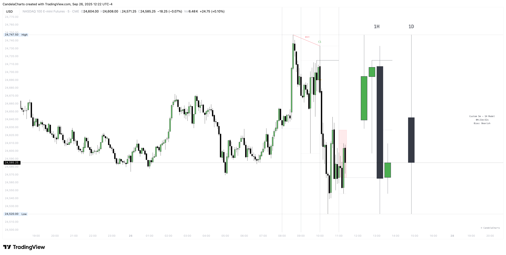
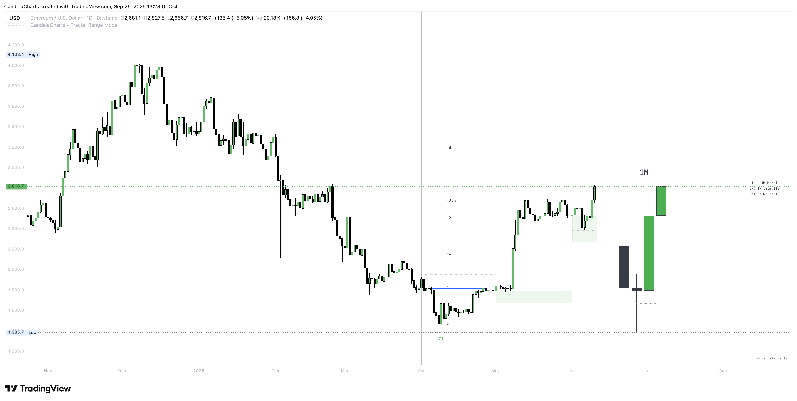

# Framework

The **Fractal Range Model** is a mechanical, repeatable pattern in the market. Where many traders go wrong is trying to pattern-trade every occurrence they see. That shotgun approach isn’t sustainable and will fail over the long run.

To use the model effectively, trade only with a **clear higher-timeframe bias**. You can establish that bias by either:

* **Framing within a higher-timeframe Fractal Range Model:** Identify the larger structure and execute inside it.
* **Applying supporting concepts:** Use phases of price, equilibrium, and candle closures to define direction and confirm context.

In short: the pattern is mechanical—your edge comes from context.

### Top Down Analysis

This quick walkthrough gives you a clean, repeatable way to align bias, planning, and execution.

#### Higher timeframe sets direction (1D / 1W / 1M)

Pick the daily, weekly, or monthly—whatever matches your style—to define directional bias. Do this by either mapping a higher-timeframe **Fractal Range Model** you’ll trade inside, or by using supporting concepts (price phases, equilibrium, and candle closures) to lock in a clear bias.

#### Intermediate timeframe builds the plan (4H / 1H)

Move down to 4H/1H to sketch structure and validate the bias. Confirm with a **Change in the State of Delivery (CISD)**, mark **points of interest (POIs)** that align with the bias, and wait for proof at the level—a reaction, decisive candle close, or formation of a **protected swing**.

#### Lower timeframe executes with precision (15M / 5M)

Use 15M/5M to refine entries and improve your risk-to-reward. After the intermediate reaction/close, look for a confirming **CISD** so all three timeframes speak the same language. Trigger entries on **new protected highs/lows** or **continuation order blocks** in your direction, place stops beyond the protected high/low, and target higher-timeframe objectives.

<figure><figcaption></figcaption></figure>

### Expansion Candles

This brief overview describes how expansions behave and how to set realistic expectations.

* **Shallow pullbacks, fast legs:** Expansion phases often retrace only lightly and move aggressively in the trend direction.
* **Half‑range tendency:** In a bullish expansion, price frequently operates in the **upper half** of the range; in a bearish expansion, in the **lower half**.
* **Context first:** The goal is to trade **with** the higher‑timeframe bias, not to chase every pattern print.

### Phases of Price&#x20;

<figure><figcaption></figcaption></figure>

Typical cycle elements you’ll observe include:

* **Reversal** – the initial turn that shifts delivery.
* **Expansion** – the impulsive leg in the new direction.
* **Retracement** – a pause or pullback that often remains shallow in expansions.
* **Consolidation** – a range‑bound phase that can precede the next move.


**Mean or Equilibrium (0.5):** The midpoint of your chosen range is a key reference. During expansions, reactions frequently occur around this level without deep discount (bullish) or premium (bearish) retracements.


### Understanding Mean

<figure><figcaption></figcaption></figure>

When the market is expanding, pullbacks are typically shallow. So rather than waiting for deep discount/premium tests, we read 0.5 as a midline:

* **Upper half respected →** bias to trade **higher**.
* **Lower half respected →** bias to trade **lower**.&#x20;

If the respected half fails, we can **flip bias** and anticipate the opposite side of the range to be taken.

#### Applying Mean in Expansions

* In a **bullish** expansion, the **upper half** of the candle/range often acts as **support** for continuation.
* In a **bearish** expansion, the **lower half** often acts as **resistance** for continuation. If these levels do not respect, reassess the bias.

### Understanding C-area

The **C-area** is a rules‑based zone derived from higher‑timeframe (HTF) structure that highlights where the next HTF candle is likely to wick during **expansions**. It blends **Mean** (equilibrium) logic, decisive candle closures, and trend shifts to give a clean, repeatable focus area.

<figure><figcaption></figcaption></figure>

**Definition**

The **C-area** is the price zone between the current candle's open and the previous candle's midpoint (0.5 of its range). It highlights early positioning relative to the prior candle's balance and acts as a contextual reference for potential intraday continuation or rejection.

**Formation**

* **Bullish C-area:** The C-area spans from the current open **down** to previous candle equilibrium.
* **Bearish C-area:** The C-area spans from the current open **up** to previous candle equilibrium.


The C-areas can also be interpreted as the MMXM Model, as they often emphasize MMSM and MMBM accumulation zones.


**Interpretation**

* When price trades into the C-area and **respects** the prior midpoint (rejects or consolidates without violating it), it supports the respective MMXM directional model.
  * In a **bullish C-area**, holding **above** the prior midpoint often precedes upward continuation.
  * In a **bearish C-area**, rejection **from** the prior midpoint typically signals renewed downside pressure.


Inside the C-area, locate a **Fair Value Gap (FVG)**, **Order Block (OB)**, **Breaker**, or a comparable point of interest that can serve as entry.


**Invalidation**

* **Bullish C-area:** A decisive close **below** the previous candle's midpoint (loss of mean support).
* **Bearish C-area:** A decisive close **above** the previous candle's midpoint (loss of mean resistance).

### Candle Wicks

Candlestick wicks often carry more signal than the body. Read correctly, they reveal rejection from key levels and can mark turning points—especially when you align higher and lower timeframes.

#### What Wicks Indicate

* A **lower wick** shows an aggressive drive down that was bought back up before close → a **bullish** hint.
* An **upper wick** shows an aggressive drive up that was sold back down before close → a **bearish** hint. In short, wicks are **mini‑reversals on lower timeframes**.


A strong reversal candle with a large wick usually prints a clear **“V”** shape on the lower timeframe.


#### The 50% Rule of a Wick

* **Mark the wick midpoint:** From body → high (upper wick) or body → low (lower wick).
* **Respect:** If price **holds** the 0.5 of the wick, continuation is favored **against** the wick’s direction (i.e., lower‑wick → up; upper‑wick → down).
* **Disrespect:** If price **closes through** the 0.5 of the wick, the wick is likely invalidated and price may continue **with** the original impulse.


Prioritize wicks that tag a **Fair Value Gap (FVG)** or **take a key high/low**. De‑prioritize wicks that form entirely inside a noisy internal range.


### Trading Candle 2

Timing and structure matter as much as direction. In the **Fractal Range Model**, **Candle 2** is the reversal candle whose wick, body, and context tell you whether the next leg is likely to **trend** or merely **retrace**. When specific criteria are present, Candle 2 can also be traded directly.

<figure><figcaption></figcaption></figure>

#### Expansion vs. Reversal Candles

* **Expansion candle:** Small wicks on both ends, a strong body, and clear one‑way momentum during its period.
* **Reversal candle (Candle 2):** Opens, drives strongly the other way (creating a long opposing wick), and closes near its open—hinting at a shift in direction. Not every reversal is tradeable; context decides.


**Key takeaway:** Small wicks favor continued expansion; large wicks often cap expansion because much of the range was already consumed creating the wick.


#### Why Wick Size Matters

* **Small‑wick reversal:** Price hasn’t used much range to print the wick, so there’s room to run. Consider deeper targets: prior highs/lows, liquidity pools, and standard‑deviation projections.
* **Large‑wick reversal:** Much of the candle’s range was spent forming the wick. Expect mean‑reversion style movement (toward the open or session extremes) rather than a long trend leg.

_Think of wick size as a fuel gauge: less wick → more runway._

#### Correlated Markets & SMT

Use related instruments for confirmation and confluence. If one market sits at a clean reversal area but a correlated market is clearly stronger/weaker, prioritize the one that **aligns with your bias**. This helps avoid false CISD and improves signal quality.

#### Key takeaways

* **Small wick →** more potential for **range expansion**.
* **Large wick →** less potential; use tighter targets.
* Always size expectations by **wick size** and **session context**.
* Continuations frequently follow the day **after** a large‑wick reversal.

### Trading Candle 3

Candle 2 is the **reversal**, Candle 3 is the **continuation**, and Candle 4 often acts as a **secondary continuation**. Candle 3 aims to capture the directional move **after** the reversal has set the bias.

<figure><figcaption></figcaption></figure>

#### The Key Concept: Wick Size & Expansion

Wick size on **Candle 2** determines whether you trade the reversal itself or wait for continuation.

* **Small wick on Candle 2 →** more expansion potential → you can trade **Candle 2** directly.
* **Large wick on Candle 2 →** range already consumed → let Candle 2 **close** and trade **Candle 3** instead.


Small wick → trade Candle 2.\
Large wick → wait for Candle 3.


#### When Candle 3 Isn’t Ideal

Avoid low‑quality continuations:

* If **Candle 2** was already a strong **expansion**, Candle 3 may be a **chase** into retrace or chop.
* In such cases, demand extra confluence on LTF: protected swings, **SMT** divergence, or multiple continuation cues aligning.

#### Key Takeaways

* **Wick size** decides: trade **Candle 2** (small wick) vs. **Candle 3** (large wick).
* Candle 3 captures **expansion** after the reversal.
* Always confirm with **CISD**, **FVG/OB**, and **protected swings**.
* Don’t chase Candle 3 after a big Candle 2 expansion—wait for cleaner continuation context.
* The best setups come from **multi‑timeframe continuation alignment**.

Context over pattern: establish a clear higher-timeframe bias, then align the intermediate and lower timeframes so they’re speaking the same language. Let equilibrium (0.5) and the C-area frame where you expect reaction or follow-through, and use CISD, wick-50% respect, and PD arrays to time entries—if alignment breaks, honor invalidation and wait for the next clean continuation.
