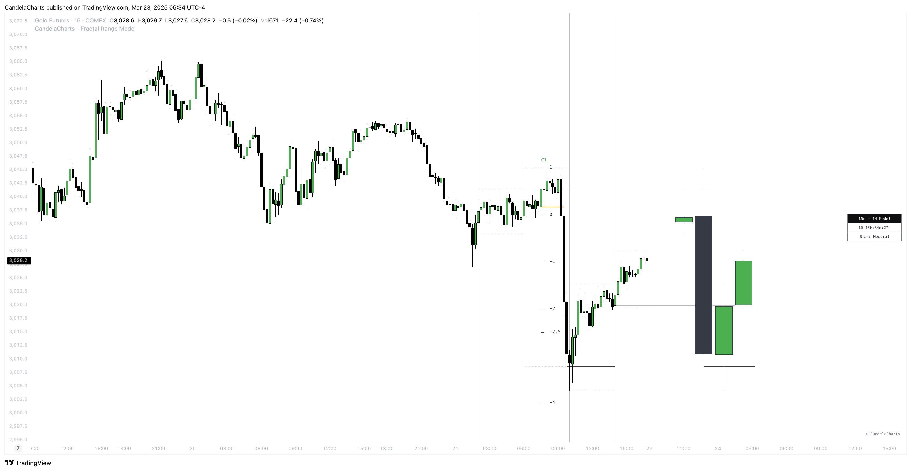

# Projections

Once a model is formed, the **Fractal Range Model (FRM)** automatically generates **projection levels** based on **standard deviations**.&#x20;

<figure><figcaption></figcaption></figure>

These projections are calculated from the **CISD Low** to the **CISD High**, offering a dynamic view of potential price movement and volatility.&#x20;

The projections provide traders with valuable insight into possible future price ranges, helping to guide trade planning and decision-making.

### Projection Setup and Customization

The projections can be anchored to either the **body** or the **wicks** of the **CISD High** and **CISD Low**, giving traders flexibility in how they interpret the model’s projected price levels.

* **Body Anchoring**: By using the body of the CISD High or Low, traders focus on the central price area, providing a more conservative and stable projection.
* **Wick Anchoring**: Alternatively, by using the wicks of the CISD High or Low, the projection captures the full range of price movement, accounting for potential volatility and broader market fluctuations.

This flexibility allows traders to adjust their projections based on their preferred risk profile and trading strategy.

### Purpose and Application

The **Fractal Range Model**’s automatic projection levels are essential tools for understanding market potential after a model has formed.&#x20;

The projections not only show potential price targets but also act as a guide for traders to assess potential market behavior and make informed decisions.&#x20;

Whether used for planning **exits**, managing **risk**, or evaluating market trends, these projections are a key feature of the model's functionality.
