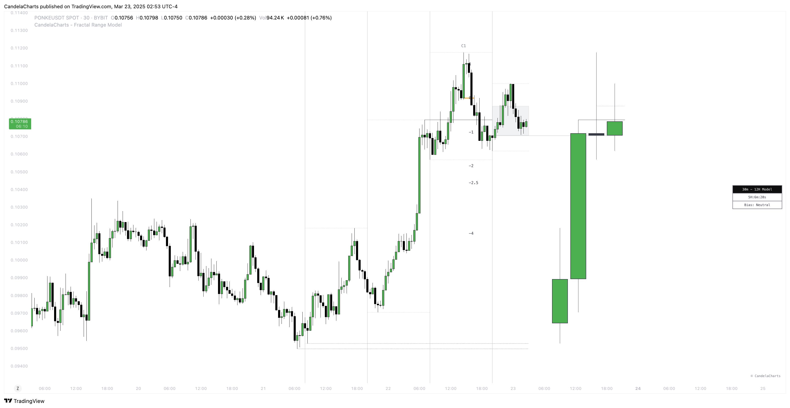
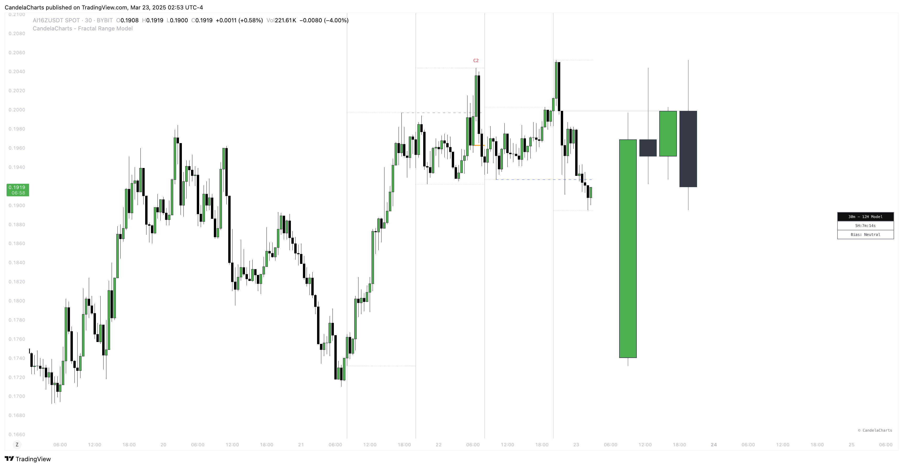
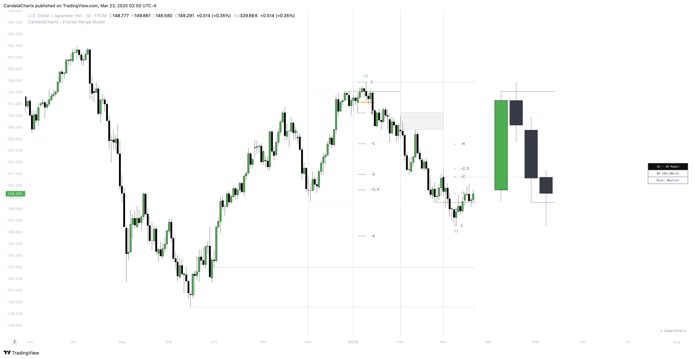

# Statuses

The Fractal Range Model follows a specific lifecycle, which highlights the current state of the model and determines whether a trade opportunity is valid.&#x20;

The model's lifecycle includes the following statuses:

1. **Formation**
2. **Pre-Invalidation**
3. **Invalidation**
4. **Success**

### **1. Formation**

The **Formation** phase marks the initial setup of the Fractal Range Model.&#x20;

<figure><figcaption></figcaption></figure>

During this stage, the model identifies and plots key components, such as:

* **Sweeps**: Market movements that indicate a potential reversal or strong shift in trend.
* **CISD (Change In State of Delivery)**: A structural change that provides insight into trend shifts.

Once these components are detected, the model automatically calculates and displays **Projections** and **Liquidity Levels**, offering insights into potential price action movements.

At this stage, the model also identifies and displays the following key elements, provided they are available:

* **HTF PD Arrays** (Higher-Timeframe PD Arrays)
* **LTF PD Arrays** (Lower-Timeframe PD Arrays)
* **SMT (Smart Money Technique)**

If any of these elements are present, they will be automatically displayed on the chart.

### **2. Pre-Invalidation**

A Fractal Range Model is considered pre-invalidated when the body of the subsequent candle closes above the sweep, yet the high that formed the sweep remains intact.&#x20;

In such cases, the model is typically deemed unreliable, as it suggests a potential failure in most instances.&#x20;

Despite this, the high from the original sweep continues to hold significance, indicating that the model has not yet been fully invalidated but is on the brink of doing so.&#x20;

Most of the time, these models do not result in successful outcomes.

### **3. Invalidation**

A Fractal Range Model is considered **invalidated** when the price does not reach the **2 Standard Deviation** level or the first identified liquidity level, and when the price breaks above the high that formed the **Sweep**.&#x20;

<figure><figcaption></figcaption></figure>

Invalidation signals that the original setup is no longer reliable, and traders should avoid taking action based on the model's original parameters.

**Key Invalidation Conditions**:

* Price fails to reach the **2 Standard Deviation** level.
* Price fails to reach the **first liquidity level**.
* Price breaks the **high/low** that initiated the **Sweep**.

### **4. Success**

A Fractal Range Model is considered **successful** when the price reaches the **2 Standard Deviation** level or the first identified liquidity level.&#x20;

<figure><figcaption></figcaption></figure>

This indicates that the model's predictions align with actual market movements, confirming the setup's validity and providing a potential trading signal.

**Key Success Conditions**:

* Price reaches the **2 Standard Deviation** level.
* Price reaches the **first liquidity level**.

By leveraging these phases—**Formation**, **Invalidation**, and **Success**—traders can effectively manage their positions, minimize risk, and capitalize on high-probability setups based on the Fractal Range Model.
