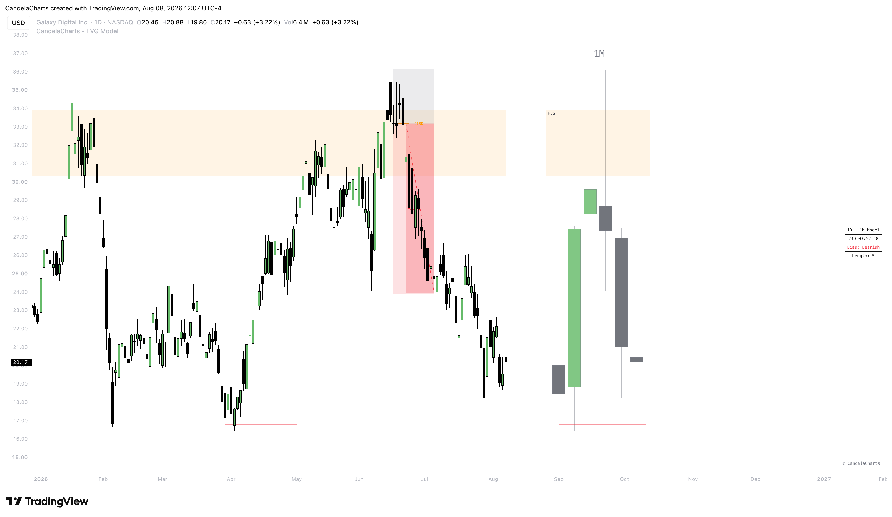

# FVG Model™

The **CandelaCharts - FVG Model** is a multi-timeframe Fair Value Gap trading system designed for TradingView. It automatically detects when Higher Timeframe (HTF) liquidity is swept and then maps the resulting Fair Value Gaps directly onto your Lower Timeframe (LTF) chart, eliminating the need to constantly switch timeframes while hunting for high-probability setups.

<figure><figcaption></figcaption></figure>

The model is built on the premise that institutional order flow leaves behind structural footprints — specifically, FVGs formed during displacement moves that follow liquidity sweeps. By pairing your execution timeframe with a higher timeframe for context, the FVG Model identifies these footprints in real-time and provides clear entry zones, structural confirmation, and projected targets.

Whether you are a scalper working off 1-minute charts or a swing trader analyzing daily structure, the FVG Model adapts to your workflow through its intelligent Automatic Pairing system or fully customizable manual timeframe definitions.
