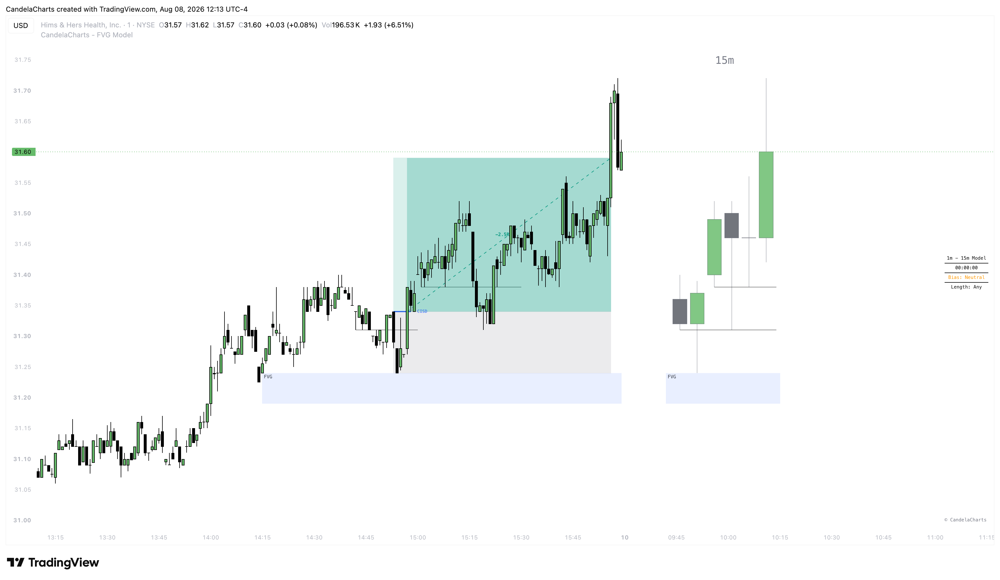

# Dashboard

<figure><figcaption></figcaption></figure>

The FVG Model includes an on-chart informational dashboard that provides a quick-glance summary of the current model state and key trading context.

### Configuration

* **Dashboard**: Master toggle to show or hide the dashboard panel.
* **Position**: Choose where the dashboard is anchored on your chart. Options include all 9 positions: Top Left, Top Center, Top Right, Middle Left, Middle Center, Middle Right, Bottom Left, Bottom Center, Bottom Right.
* **Text Size**: Adjust the text scale of the dashboard contents. Options include Tiny, Small, Normal, Large, Huge, and Auto.
