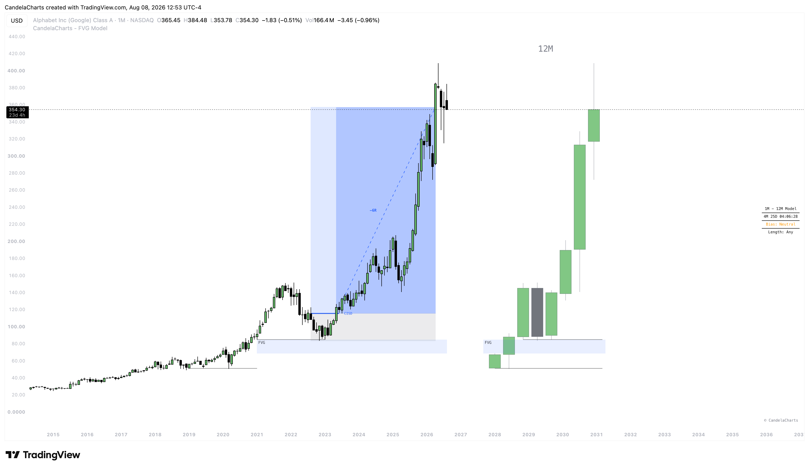

# Framework

<figure><figcaption></figcaption></figure>

This page walks you through the step-by-step process of trading with the FVG Model — from reading the chart all the way to managing your position. Think of it as your playbook.

### Step 1 — Read the HTF Candles

Before anything else, take a moment to look at the HTF candles the model has drawn on the right side of your chart. These candles show you the bigger picture — the macro trend, the recent swing structure, and most importantly, where liquidity is sitting.

You're looking for untouched HTF candle highs and lows. These are the levels where stop-losses have been accumulating. If the market has been trending up and you see a clean HTF low that hasn't been swept yet, that's a magnet. Institutional players need that liquidity before they can move price further.

Don't rush into the chart the moment it loads. Let the HTF candles tell you the story first. Are we in a range? Are we trending? Is there a clear pool of liquidity sitting just below or above the current price? Once you've identified the target, you wait.

### Step 2 — Wait for the Sweep

This is where patience matters most. You know where liquidity is resting, but you need the market to actually go and take it before you can act.

A sweep happens when price pushes past a previous HTF candle's high or low — even if just by a few ticks — grabbing the stop-losses sitting at that level. The indicator will automatically mark this with a sweep line so you don't have to second-guess it.

The key here is to not jump in the moment you see a wick beyond the level. The sweep is just the first piece of the puzzle. It tells you that liquidity has been taken, but it doesn't yet confirm that the market is ready to reverse.

### Step 3 — Confirm the Structure Shift

This is the confirmation step, and it's what separates this model from blindly fading every wick.

After the sweep, the model shifts focus to your LTF chart and waits for a genuine structural break. Depending on your setting, this is either:

* A **CISD** (Change in State of Delivery) — where a candle closes beyond the body of the previous opposing candle, showing that the delivery of price has flipped direction.
* An **MSS** (Market Structure Shift) — where price breaks a recent swing point with a confirmed close, indicating a more aggressive and definitive reversal.

Once this break is confirmed, the model lights up. The setup is now validated — the sweep was real, the structure has shifted, and the indicator draws the model on your chart.

If you don't get a structure shift after the sweep, there's no trade. Simple as that. The model protects you from chasing sweeps that turn out to be continuations.


One critical factor that directly impacts your success rate is the **Length** setting. Length controls the maximum distance (in HTF candles) allowed between the FVG and the sweep. The tighter this value, the stronger the confluence — a sweep that happens right next to the FVG means the imbalance is fresh and the institutional footprint is immediate. Setting Length to `2` or `3` will significantly reduce the number of models that appear, but the ones that do appear will have a noticeably higher completion rate. Conversely, a Length of `8` or `10` will produce more setups, but many of them will be weaker because the FVG and the sweep are too far apart structurally. Start tight and loosen only if you're not getting enough setups on your instrument.


### Step 4 — Identify Your Entry

Now that the model is confirmed, the HTF Fair Value Gap is mapped directly onto your LTF chart as a colored box. This is your entry zone.

The idea is straightforward: after a displacement move (the one that caused the structure shift), price tends to pull back to fill the imbalance — the FVG — before continuing in the new direction. Your job is to wait for that pullback.

If you've enabled the **CE line** (Consequent Encroachment), the midpoint of the FVG is also drawn. Many traders use this 50% level as a precision entry rather than entering at the edge of the FVG. It gives you a slightly better fill at the cost of potentially missing the trade if price barely taps the FVG and reverses immediately.

Don't chase the initial move. Let price come to you. The FVG is the zone where you want to be positioned.

### Step 5 — Define Your Risk

Your stop-loss is handled by the Standard Deviation projection, and it's placed at 1 standard deviation from the anchor point.

<figure><figcaption></figcaption></figure>

The anchor depends on your setting:

* **Wick anchor**: Measures from the absolute extreme of the sweep candle. This gives you a wider stop with more breathing room — useful on volatile pairs or during news events.
* **Body anchor**: Measures from the candle's close/open. This gives you a tighter stop and a better R:R ratio, but leaves less room for noise.

Place your actual stop just beyond the projection level. The model has already done the math for you — the projection line on the chart is exactly where your risk is defined.

### Step 6 — Manage the Trade

Once you're in, the take-profit target is already plotted on the chart as a Standard Deviation projection at your configured multiplier (e.g., -2.5 means 2.5x the risk distance).

Let the trade breathe. Don't micromanage every tick. The model will automatically track the setup for you:

* If price reaches the TP level, the model status changes to **Completed** and you'll receive an alert if enabled.
* If price reverses and breaches the stop level, the model status changes to **Failed** and you're alerted to exit.

Some traders prefer to take partials at intermediate levels (e.g., 1x risk) and let the remainder run to the full target. That's entirely up to your risk management style — the model gives you the framework, you decide how to execute within it.
