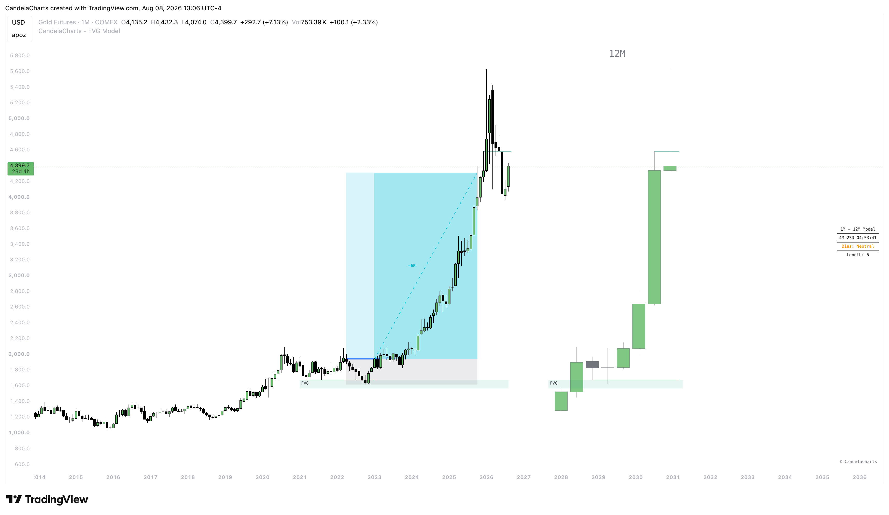

# Projections

The FVG Model uses Standard Deviation projections as its primary trade management tool.&#x20;

<figure><figcaption></figcaption></figure>

Once a model is confirmed (sweep + market structure shift + FVG), the indicator automatically calculates and draws projected take-profit and stop-loss zones based on the distance between the anchor point and the structural break.

### How It Works

1. The model identifies the **anchor candle** — the LTF candle at the point of the sweep.
2. It measures the distance between the anchor point and the market structure break level.
3. This distance is then multiplied by the **standard deviation multiplier** you define, projecting the take-profit zone in the direction of the trade.
4. A stop-loss zone is placed at 1 standard deviation on the opposing side.

### Anchor Options

You can choose what part of the anchor candle is used for the projection calculation:

* **Wick**: Uses the absolute high (for bearish) or low (for bullish) of the anchor candle. This produces wider projections with a more conservative risk calculation.
* **Body**: Uses the candle's open/close (whichever is the extreme). This produces tighter projections with an aggressive risk calculation.

### Take Profit Level

The **Take Profit** input defines the standard deviation multiplier used to project the TP target. The default value is `-2.5`, meaning the take-profit is projected at 2.5x the distance between the anchor and the structure break, in the direction of the trade. The negative sign indicates projection in the trade direction.

You can adjust this value between `-10.0` and `0.1` in `0.1` increments to fine-tune your target aggressiveness.

### Stop Loss Level

The stop-loss is fixed at `1` standard deviation — meaning it is placed at exactly 1x the measured distance, on the opposing side of the anchor. This provides a natural 1R risk reference point.

### Visual Customization

* **Bullish TP Color**: Color of the take-profit projection zone for bullish models.
* **Bearish TP Color**: Color of the take-profit projection zone for bearish models.
* **Stop Loss Color**: Color of the stop-loss projection zone (applies to both directions).
* **Show TP Labels**: Toggle visibility of text labels on the take-profit lines.
* **Label Size**: Control the text size of TP labels (Tiny, Small, Normal, Large, Huge, Auto).
