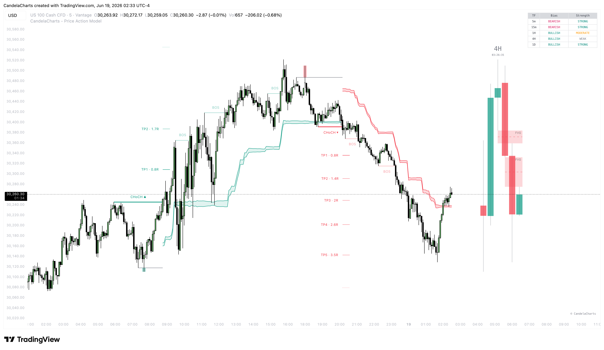

# Price Action Model™ 🔜

The **Price Action Model** is a premium, comprehensive indicator designed for traders who rely on core price action concepts, smart money mechanics, and structural analysis. It removes the subjectivity from chart reading by automating the detection of high-probability setups.

<figure><figcaption></figcaption></figure>

At its core, this model believes that markets are driven by liquidity and structure. Retail traders often place their stop-losses at obvious pivot highs and lows. Smart money (institutions and large players) target these liquidity pools to fill their massive orders.

This indicator is specifically engineered to wait for these "Liquidity Sweeps" to occur. It then watches for a confirmed "Change of Character" (CHoCH) to ensure the trend is actually reversing before signaling a valid setup.

Beyond just signaling entries, the Price Action Model provides an end-to-end trading framework:

1. **Context:** Understand the macro narrative using HTF Overlays and the MTF Dashboard.
2. **Setup:** Identify when retail stops have been hunted via Liquidity Sweeps.
3. **Confirmation:** Confirm the reversal via automated Market Structure shifts (CHoCH).
4. **Management:** Manage the trade mechanically using volatility-adjusted Dynamic Targets and an ATR Trailing Stop.

Whether you trade forex, crypto, or equities, this tool provides the structure needed to execute disciplined, high-probability trades.


* This model is designed for educational and analytical purposes to study market structure, trends, and price behavior.
* It does not provide trading signals and should not be used as a substitute for independent analysis or proper risk management.
* The model is timeframe - and symbol-agnostic, automatically adapting to any market, asset, or chart it is applied to.

