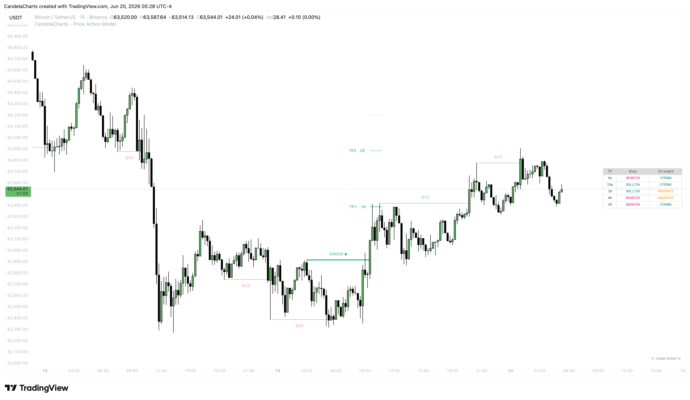
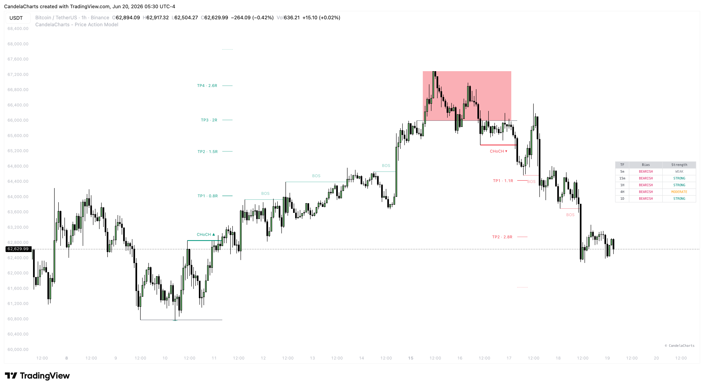
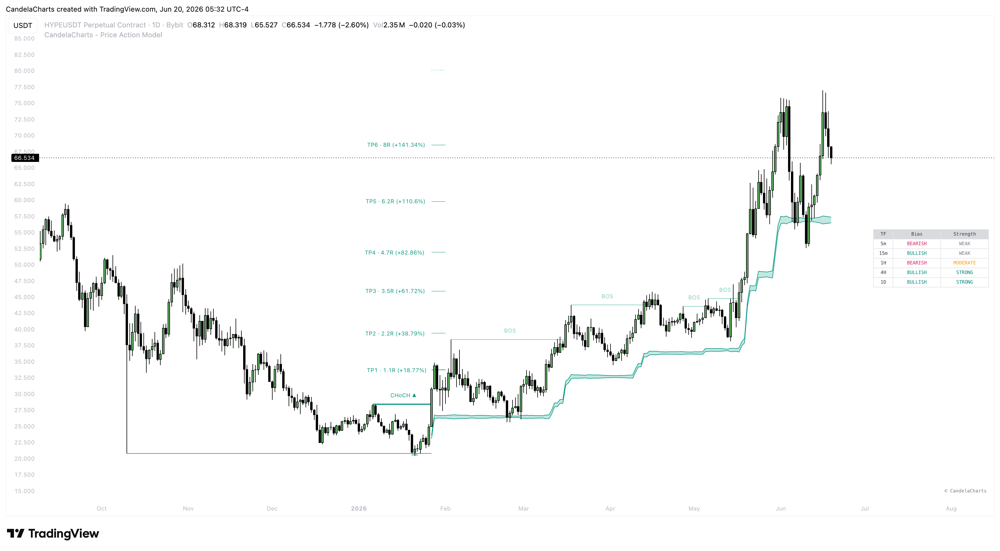
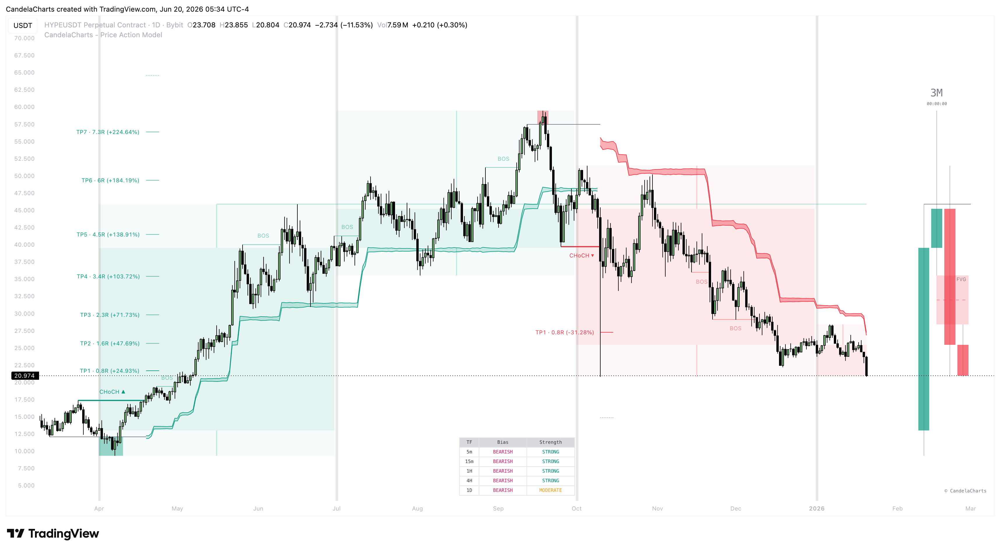

# Components

The Price Action Model utilizes a variety of visual components drawn directly onto your chart. Understanding these components is essential for reading the model correctly.

### Market Structure Elements

<figure><figcaption></figcaption></figure>

* **Solid/Dashed Lines (CHoCH & BOS):** Horizontal lines projected from pivot points.
  * A line labeled **CHoCH** denotes the initial, defining shift in the trend direction.
  * A line labeled **BOS** highlights the continuation of the trend after the CHoCH.
  * The color of the line (Bullish or Bearish) indicates the direction of the break.

### Liquidity & Setup Elements

<figure><figcaption></figcaption></figure>

* **Liquidity Lines:** Thin, customizable lines representing resting liquidity at previous pivot highs and lows. These act as magnets for price.
* **Sweep Area (S-Area) Box:** A shaded rectangular box that appears when a liquidity line is broken and subsequently reversed. It highlights the exact area where the stop-run (liquidity grab) took place.
  * _Green Box:_ Sell-side liquidity sweep (Bullish setup).
  * _Red Box:_ Buy-side liquidity sweep (Bearish setup).

### Trade Management Elements

<figure><figcaption></figcaption></figure>

* **Trailing Stop Band:** A dynamic, shaded ribbon following the price action.
  * Its width expands and contracts based on trend strength and ATR (Average True Range).
  * Use the upper/lower edges of this band as a mechanical guide for trailing your stop-loss.
* **Dynamic TP Targets:** Horizontal lines extending forward from the point the model forms. They are labeled sequentially (TP1, TP2, TP3) and represent logical, volatility-adjusted zones to scale out of your position.

### Higher Timeframe (HTF) Overlays

<figure><figcaption></figcaption></figure>

* **Ghost Candles:** Faded, semi-transparent blocks overlaying the chart. These represent the open, high, low, and close of Higher Timeframe candles, allowing you to track HTF development without switching charts.
* **HTF FVG Zones:** Lightly shaded zones highlighting unmitigated Fair Value Gaps from higher timeframes. These zones act as strong areas of support, resistance, or magnets for price.
