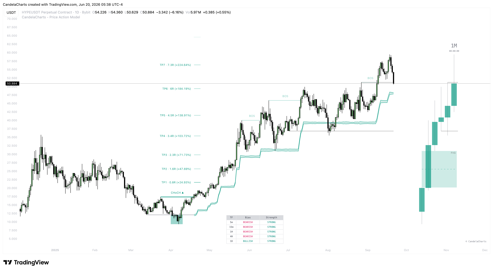

# Dashboard

The **MTF Dashboard** is your command center for establishing bias and trend confluence. Instead of manually clicking through multiple timeframes to determine the overall market direction, the dashboard aggregates this data into a sleek, unobtrusive table directly on your chart.

<figure><figcaption></figcaption></figure>

### Dashboard Configuration

* **Visibility & Positioning:** You can toggle the dashboard on or off and place it anywhere on your chart (Top Right, Bottom Left, Middle, etc.) so it never obstructs your view of the price action.
* **Custom Timeframes:** You can track up to 5 individual timeframes simultaneously. By default, these might be 5m, 15m, 1H, 4H, and 1D, but you can customize them to fit your specific trading style (e.g., scalpers might use 1m, 3m, 5m, 15m, 1H).

### How to Read the Dashboard

The dashboard uses a clean visual interface to communicate two main pieces of data for each timeframe:

1. **Bias (Direction):** Indicated by color (typically Teal for Bullish, Red for Bearish). This tells you the current structural trend of that specific timeframe.
2. **Trend Strength:** Some timeframes may show stronger momentum than others. The dashboard helps you gauge whether a trend is robust or starting to chop.

### Strategic Usage

The most powerful way to use the dashboard is as an **Execution Filter**.

* **The Golden Rule:** Never enter a trade if your lower timeframes are actively fighting your higher timeframes.
* **Alignment:** If you are looking to take a long position on the 15m chart based on a bullish Price Action Model, check the dashboard first. If the 1H and 4H are screaming Bearish, _sit on your hands_. Wait until the 15m and 1H align with the 4H direction before committing capital.
